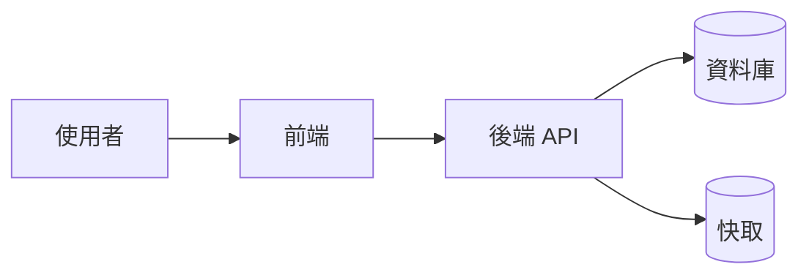
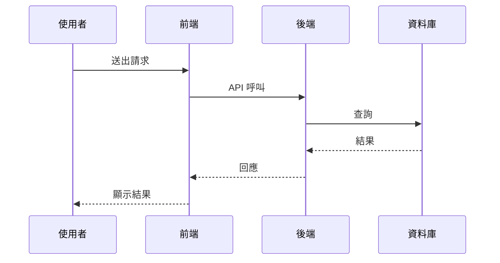

# 請幫我建立 Write-doc-before-Code 流程

> 使用方式：到目標專案根目錄開啟 Claude Code，複製「一鍵產生」區塊貼上即可。
> 不需要手動填寫任何資訊，AI 會自動掃描專案結構。

---

請依專案實際狀況調整  - Write-doc-before-Code 流程 ，如果有衝突抵觸，以這份文件優先，刪除重覆或不需要的。

- 自動掃描工作目錄，辨識子專案、技術棧、命名慣例
- 唯一需要提供的是：**專案的一句話描述**（用於 CLAUDE.md 開頭）

## Claude Code 正確目錄結構

```text
{project-root}/
├── CLAUDE.md                              # 最高層級 AI 指引（啟動時自動載入）
├── README.md                              # 給人類看的專案說明
│
├── .claude/                               # Claude Code Agent 設定資料夾
│   ├── settings.json                      # Hook 設定（PreToolUse 攔截等）
│   ├── hooks/                             # Hook 腳本（硬性攔截）
│   │   ├── spec-before-code.mjs           # PreToolUse：Edit/Write 前強制 Spec（檢查檔案路徑）
│   │   ├── post-tool-use-spec-tracker.mjs # PostToolUse：Edit/Write 後自動記錄實際變更至 Spec
│   │   ├── session-start-brief.mjs        # SessionStart：顯示進行中的 Plan/Spec 上下文摘要
│   │   ├── session-end-archive.mjs        # SessionEnd ①：歸檔 ✅ 文件 + 寫入 archive manifest
│   │   └── session-end-knowledge.mjs      # SessionEnd ②：讀 manifest，呼叫 Claude CLI 提煉知識庫
│   ├── commands/                          # 自訂 Slash 指令（/create-spec 等）
│   │   ├── _spec-convention.md            # Spec 撰寫慣例（被其他指令引用）
│   │   └── create-spec.md                 # /create-spec 指令
│   ├── rules/                             # 常駐規則（輔助 CLAUDE.md，自動載入）
│   │   └── spec-before-code.md            # 強制 Spec-before-Code 規則
│   └── skills/                            # 按需呼叫的擴充技能
│       └── multi-project-workflow.md      # 多專案協作技能
│
├── {子專案-A}/                             # 自動偵測的子專案資料夾
├── {子專案-B}/                             # （名稱由掃描決定）
├── {子專案-C}/
│
├── docs/                                  # 共用文件（跨專案）
│   ├── README.md
│   ├── requirements/                      # 產品需求文件（PRD）— 大型需求的可選前置
│   │   ├── README.md
│   │   ├── _prd-template.md
│   │   ├── doing/                         # 🟡 討論中（新建 PRD 放這裡，與使用者反覆迭代）
│   │   └── completed/                     # ✅ 已確認歸檔（確認後由 Hook 搬移；Plan 建立後才啟動）
│   ├── specs/                             # 技術規格文件
│   │   ├── _spec-template.md
│   │   ├── doing/                         # 🔵 開發中（新建 Spec 放這裡）
│   │   └── completed/                     # ✅ 已完成歸檔
│   ├── bugs/                              # Bug 知識庫
│   │   ├── README.md
│   │   ├── _bug-template.md
│   │   ├── doing/                         # 🔵 修復中（新建 Bug 放這裡）
│   │   └── completed/                     # ✅ 已修復歸檔
│   ├── knowledge/                         # 流程知識庫（AI 自動提煉）
│   │   ├── README.md
│   │   ├── _knowledge-template.md
│   │   ├── architecture/                  # 架構知識（模組關係、資料流）
│   │   ├── patterns/                      # 開發模式（常用 pattern、慣例）
│   │   ├── domain/                        # 業務領域知識（商業規則、流程）
│   │   └── integrations/                  # 整合知識（API 串接、第三方服務）
│   ├── decisions/                         # 技術決策記錄
│   │   └── README.md
│   ├── plans/                             # 功能開發計劃書
│   │   ├── README.md
│   │   ├── _plan-template.md
│   │   ├── doing/                         # 🔵 進行中（新建 Plan 放這裡，恆為單檔 .md）
│   │   │   └── 20260311-001-feature.md    #   需求規格透過 docs/requirements/ PRD 承載
│   │   └── completed/                     # ✅ 已完成歸檔
│   └── logs/                              # 開發日誌 / 變更紀錄
│       └── README.md
```

### 各目錄角色對照

| 目錄 | 載入方式 | 用途 |
| --- | --- | --- |
| `CLAUDE.md` | 啟動自動載入 | 專案總覽、強制性規則、資料夾說明 |
| `.claude/settings.json` | 啟動自動載入 | Hook 設定（PreToolUse 攔截等） |
| `.claude/hooks/` | 由 Hook 事件觸發 | 硬性攔截腳本（Node.js ESM） |
| `.claude/commands/` | 使用者輸入 `/指令名` 觸發 | 自訂 Slash 指令（如 `/create-spec`） |
| `.claude/rules/` | 啟動自動載入 | 細部常駐規則（補充 CLAUDE.md） |
| `.claude/skills/` | AI 依情境按需呼叫 | 專業工作流技能模組 |
| `docs/requirements/{doing,completed}/` | 需求討論 / Plan 建立時引用 | 產品需求文件（PRD），與使用者反覆討論至 ✅ 已確認後方可進入 Plan |
| `docs/specs/{doing,completed}/` | 開發流程中引用 | Spec-before-Code 技術規格 |
| `docs/bugs/{doing,completed}/` | 開發流程中引用 | Bug 知識庫 |
| `docs/plans/{doing,completed}/` | 開發流程中引用 | 功能開發計劃書 |
| `docs/knowledge/{category}/` | AI 完成任務時自動提煉；規劃時主動查閱 | 流程知識庫（架構/模式/領域/整合） |
| `docs/logs/` | 開發流程中引用 | 開發日誌 / 變更紀錄 |

---

### 文件生命週期與自動撰寫規則

> 攔截方式：透過 `.claude/rules/spec-before-code.md` 規則，AI 讀取後自主遵守。
> AI 在開發流程中**自動建立與更新**以下六類文件，不需使用者額外指示。

#### 文件命名慣例

所有由 AI 自動產生的文件，檔名統一使用 **日期流水號** 格式：

```text
{YYYYMMDD}-{NNN}-{name}.ext

  YYYYMMDD  = 建立日期（如 20260311）
  NNN       = 同目錄下自動遞增的 3 位數流水號（001, 002, ...）
  {name}    = 描述性名稱，使用 kebab-case
  .ext      = 副檔名（.spec.md / .md）
```

| 文件類型 | 命名範例 |
| --- | --- |
| PRD | `docs/requirements/doing/20260311-001-kanban.md` |
| Plan | `docs/plans/doing/20260311-001-user-auth.md` |
| Spec | `docs/specs/doing/20260311-001-add-user-crud.spec.md` |
| Bug | `docs/bugs/doing/20260311-001-null-pointer-on-login.md` |
| Log | `docs/logs/20260311-001-user-auth-sprint.md` |
| Knowledge | `docs/knowledge/patterns/20260311-001-api-error-handling.md` |

> **流水號規則**：AI 建立文件時，掃描目標目錄下同日期前綴的檔案，取最大流水號 +1。
> 若當日尚無檔案則從 `001` 開始。跨日則重新計算。


#### 六類文件定位

| 文件類型 | 定位 | 回答的問題 | 粒度 | AI 何時自動寫 |
| --- | --- | --- | --- | --- |
| `docs/requirements/` | 產品需求（PRD，源頭前） | 使用者真正要什麼？邊界在哪？ | 一個產品 / 主要功能 | 使用者口頭需求模糊、需要反覆討論收斂時；1 PRD ↔ 1 Plan |
| `docs/plans/` | 功能計劃書（源頭） | 要做什麼？為什麼？ | 一個功能 / epic | PRD ✅ 已確認後 / 使用者直接提出明確需求時 |
| `docs/specs/` | 技術規格（Gate） | 怎麼改？改哪些檔案？ | 一次 PR / 任務 | Edit/Write 被攔截時 |
| `docs/bugs/` | Bug 知識庫（提煉） | 踩過什麼坑？ | 一個 Bug | 開發中遇到有通用價值的 Bug 時 |
| `docs/logs/` | 開發日誌（時間軸） | 過程中發生了什麼？ | 一天 / 里程碑 | 每個任務開始與完成時 |
| `docs/knowledge/` | 流程知識庫（永久） | 學到了什麼可複用的知識？ | 一個知識點 / 主題 | 任務完成時 AI 判斷有可複用價值 |

#### 文件流轉與自動撰寫時機

```
使用者需求
    │
    ├──── 豁免 PRD？（使用者說「直接做」「不用 PRD」/ 中小型 / 需求已明確）
    │     │
    │     ├── 是 → 直接進入下方 Step 0 規模判斷（跳過 ⓪）
    │     │
    │     └── 否 → 需求是否明確？
    │             │
    │             ├── 否 → 建議先走 ⓪ PRD 階段收斂需求
    │             │        → AI 依口頭需求產生 docs/requirements/doing/{YYYYMMDD}-{NNN}-{topic}.md
    │             │        → 🟡 討論中：使用者與 AI 反覆迭代（新增 / 修改欄位、答覆開放問題）
    │             │        → 使用者確認 → 標記 ✅ 已確認 → SessionEnd Hook 歸檔至 completed/
    │             │        → 才進入 ① Plan 流程（大型需求）
    │             │
    │             └── 是 → 直接進入下方判斷（跳過 ⓪）
    │
    ▼
┌──────────────────────────────────────────────────────────────┐
│  ⓪ AI 自動建立 PRD（僅需求模糊時，大型可選前置；可豁免跳過）    │
│     docs/requirements/doing/{YYYYMMDD}-{NNN}-{topic}.md      │
│     狀態：🟡 討論中 → ✅ 已確認（移至 completed/）            │
│     觸發：大型 + 口述不完整 + 未被豁免                        │
│     豁免：中小型 / 使用者指定跳過 / 需求已明確                │
│     規則：PRD 建立後未 ✅ 前，AI 不得建立 Plan                │
│     關係：1 PRD → 1 Plan（單一產品 / 主要功能）               │
└──────┬───────────────────────────────────────────────────────┘
       │ PRD ✅ 確認後 或 豁免時
       ▼
┌─────────────────────────────────┐
│  Step 0: AI 判斷規模             │
│  大型 → Plan + Spec(s)          │
│  中型 → 僅 Spec                 │
│  小型 → 豁免，直接改            │
└──────┬──────────┬───────────────┘
       │          │
   大型需求    中型需求
       │          │
       ▼          │
┌──────────────────────────────────────────────────────────────┐
│  ① AI 自動建立 Plan（僅大型需求）                              │
│     docs/plans/doing/{YYYYMMDD}-{NNN}-{feature}.md（恆為單檔）│
│     狀態：🔵 進行中 → ✅ 已完成（移至 completed/）            │
│     觸發：新功能 / 跨多子專案 / 架構變更 / PRD 已 ✅ 時        │
│     引用：若來自 PRD → Plan 首段連結 docs/requirements/completed/xxx │
└──────────┬───────────────────────────────────────────────────┘
           │ 確認後拆解     ◄──── 中型需求直接到這裡
           ▼
┌──────────────────────────────────────────────────────────────┐
│  ② AI 自動建立 docs/specs/doing/{YYYYMMDD}-{NNN}-{task}.spec.md               │
│     狀態：🔵 開發中 → ✅ 已完成（移至 completed/）            │
│     觸發：⛔ Edit/Write 攔截（規則自律） or Plan 拆解         │
│     內含 Bug Log 區塊                                        │
└──────┬──────────┬────────────────────────────────────────────┘
       │          │ 開發中遇 Bug
       │          ▼
       │  ┌────────────────────────────────────────────────────┐
       │  │  ③ AI 自動記入 Spec Bug Log                        │
       │  │     若有通用價值 → 自動建立 docs/bugs/doing/{YYYYMMDD}-{NNN}-{bug}.md│
       │  │     永久保留，不隨 Spec 歸檔消失                    │
       │  └────────────────────────────────────────────────────┘
       │
       │ 全程自動追加
       ▼
┌──────────────────────────────────────────────────────────────┐
│  ④ AI 自動追加 docs/logs/{YYYYMMDD}-{NNN}-{topic}.md            │
│     記錄：開始開發、重要決策、踩坑、完成里程碑               │
│     append-only，不刪除、不搬移                              │
└──────────────────────────────────────────────────────────────┘
       │
       │ 任務完成時 AI 判斷
       ▼
┌──────────────────────────────────────────────────────────────┐
│  ⑤ AI 自動提煉 docs/knowledge/{category}/{YYYYMMDD}-{NNN}-{topic}.md│
│     分類：architecture/ | patterns/ | domain/ | integrations/│
│     觸發：Spec 標記 ✅ 時，AI 檢視開發過程判斷是否有可複用知識   │
│     行為：有相關既有知識 → 更新；無 → 新建；無可提煉 → 跳過   │
│     永久保留，不走 doing/completed/ 流程                      │
└──────────────────────────────────────────────────────────────┘
       ▲
       │ 規劃時反向查閱
       │
┌──────────────────────────────────────────────────────────────┐
│  ⑥ AI 建立 Plan/Spec 前，先掃描 docs/knowledge/ 查找相關知識  │
│     將既有知識納入規劃，避免重複踩坑                          │
└──────────────────────────────────────────────────────────────┘
```

#### AI 自動撰寫動作對照表

| 事件 | AI 判斷 | AI 自動執行的動作 |
| --- | --- | --- |
| 使用者提出需求 | 判斷需求是否明確 + 規模（大/中/小） + 是否豁免 PRD | 需求模糊且為大型且未豁免 → 先建 PRD 於 `doing/`；需求明確或被豁免且大型 → 直接建 Plan；中型 → 直接建 Spec；小型 → 豁免 |
| 使用者說「直接做 / 不用 PRD / 快速做」 | 偵測豁免意圖 | 跳過 PRD 建立，依規模直接走 Plan 或 Spec；口頭告知「本次跳過 PRD，原因：使用者指定」 |
| 使用者迭代 PRD 內容 | 檢視 PRD 開放問題是否收斂 | 逐題追問、修訂 PRD、更新「變更紀錄」；確認時才標記 ✅ 並建立對應 Plan（引用 PRD 路徑） |
| 大型：使用者確認 Plan | — | 拆解為 Spec(s)，Write `docs/specs/doing/{YYYYMMDD}-{NNN}-{task}.spec.md` |
| AI 準備 Edit/Write 程式碼 | 檢查有無 Spec | 沒有 → 先建立 → 等確認 → 才 Edit/Write |
| Spec 確認後開始開發 | — | 追加 `docs/logs/` 一條「開始開發」記錄 |
| 開發中遇到 Bug | 判斷是否有通用價值 | 記入 Spec Bug Log；有通用價值 → Write `docs/bugs/doing/{YYYYMMDD}-{NNN}-{bug}.md` |
| 任務完成 | — | 移 Spec/Bug 至各自 `completed/`；更新 Plan 狀態；追加 Log「完成」記錄；**提煉 Knowledge** |
| 任務完成（知識提煉） | AI 判斷是否有可複用知識 | 有 → 建立/更新 `docs/knowledge/{category}/{YYYYMMDD}-{NNN}-{topic}.md`；Bug 有通用解法 → 提煉至 knowledge；無可複用知識 → 跳過 |
| AI 建立 Plan/Spec 前 | 查閱既有知識庫 | 掃描 `docs/knowledge/` 找出相關知識，納入規劃考量，在「背景」區塊引用 |
| 所有 Spec 完成 | — | 自動將 Plan 狀態改為「已完成」 |

---

## PROMPT 範例

---

### 1. 依據新增 command 更新 README 及 CLAUDE.md

```
我新增了一個 command: `xxx`，
請幫我更新 README.md 和 CLAUDE.md，
把這個 command 的用途與用法補上去，格式跟現有的一致。
```

### 2. 依據新增 command 更新 Agent Skill

```
我新增了一個 command: `xxx`，
請幫我更新 .claude/skills/ 裡對應的 skill 文件，
新增對應的 skill 描述，格式跟現有的一致。
```

### 3. 一鍵導入：自動掃描並建立 Spec-before-Code 工作流

```
請幫我自動掃描這個工作目錄，辨識所有子專案資料夾（排除 docs/、.claude/、node_modules/ 等非專案目錄），
分析每個子專案的角色（前端/後端/資料庫/管理後台等）與技術棧，
然後建立完整的 Spec-before-Code 工作流：

1. CLAUDE.md — 專案總覽與強制性工作流協議（子專案表格由掃描結果自動填入）
2. .claude/commands/_spec-convention.md — Spec 撰寫慣例
3. .claude/commands/create-spec.md — /create-spec 指令
4. .claude/rules/spec-before-code.md — 常駐強制規則（含全文件生命週期自動撰寫）
5. .claude/skills/multi-project-workflow.md — 多專案協作技能（含自動撰寫 Plan/Spec/Bug/Log/Knowledge）
6. .claude/hooks/session-start-brief.mjs — SessionStart 上下文摘要（開場自動了解進行中工作）
7. .claude/hooks/spec-before-code.mjs — PreToolUse 精準攔截（Spec 受影響檔案路徑比對）
8. .claude/hooks/post-tool-use-spec-tracker.mjs — PostToolUse 追蹤（Edit/Write 後自動記錄實際變更）
9. .claude/hooks/session-end-archive.mjs — SessionEnd ① 歸檔（✅ 移至 completed/ + 寫 manifest）
10. .claude/hooks/session-end-knowledge.mjs — SessionEnd ② 知識提煉（讀 manifest + 更新 INDEX.md）
11. docs/specs/_spec-template.md — Spec 模板（含資料表異動、API 合約、回滾計劃區塊）
10. docs/bugs/_bug-template.md — Bug 記錄模板
11. docs/plans/_plan-template.md — Plan 計劃書模板（含系統分析、系統架構、角色與權限、WBS、資料表異動區塊）
12. docs/logs/_log-template.md — 開發日誌模板
13. docs/knowledge/_knowledge-template.md — Knowledge 知識提煉模板
14. docs/requirements/_prd-template.md — PRD 模板（產品概述、使用者故事、AC、開放問題、變更紀錄）
15. 各目錄的 README.md

專案一句話描述：{填入你的專案描述，例如「合規科技平台」「電商系統」「內部管理工具」}

規則：
- AI 自動判斷規模：大型（Plan+Spec）/ 中型（僅Spec）/ 小型（豁免）
- 大型：新功能、跨多子專案、架構變更 → 先建 Plan，確認後拆成 Spec(s)
- 中型：改動 3+ 檔案但範圍明確 → 直接建 Spec
- 小型：≤3 行、typo、設定值 → 豁免
- 檔案命名格式：{YYYYMMDD}-{NNN}-{name}.ext（日期 + 3 位流水號 + kebab-case 描述）
- 流水號規則：掃描目標目錄同日期前綴的檔案，取最大流水號 +1，當日無檔案則從 001 開始
- 跨子專案改動必須列出所有受影響的子專案
- 自動推斷開發順序（通常：資料庫 → 後端 → 前端 → 管理後台）
- AI 全程自動撰寫 Plan/Spec/Bug Log/開發日誌/Knowledge，不需使用者額外指示
- 所有文件（Plan/Spec/Bug）統一使用 doing/ 和 completed/ 兩層資料夾管理狀態
- 新建文件放 doing/，標記 ✅ 後由 SessionEnd Hook 自動歸檔至 completed/
- SessionEnd Hook 自動歸檔：Session 結束時，session-end-archive.mjs 自動掃描所有 doing/ 資料夾，將 ✅ 已完成的文件移至 completed/
- SessionEnd Hook 知識提煉：歸檔後，session-end-knowledge.mjs 透過 `spawnSync('claude', ['--print', prompt])` 將提煉 prompt 當參數傳入 Claude CLI 分析當日完成文件，自動寫入 docs/knowledge/{category}/（claude CLI 需在 PATH 中可用；`claude --print` 單獨執行會失敗，必須帶入 prompt）
- PRD 前置（大型需求模糊時）：使用者口述不完整時，AI 先於 docs/requirements/doing/ 建立 PRD，與使用者反覆討論至 ✅ 已確認後才建 Plan；1 PRD ↔ 1 Plan
- Plan 恆為單檔 `.md`：需求規格 / 設計稿 / DB schema 等統一由 PRD 承載
- Knowledge 知識提煉：任務完成時 AI 自動判斷是否有可複用知識，有則建立/更新 docs/knowledge/{category}/ 下的文件
- Knowledge 不走 doing/completed/ 流程，直接放入對應分類目錄，永久保留
- Knowledge 分類：architecture/（架構）、patterns/（開發模式）、domain/（業務領域）、integrations/（整合）
- AI 建立 Plan/Spec 前必須先查閱 docs/knowledge/ 既有知識（architecture/、patterns/、domain/、integrations/ 四個子目錄），避免重複踩坑
- 有資料表異動（新增/修改/刪除資料表或欄位）時，Plan 必須填寫「資料表異動」區塊（含欄位明細表、型別、約束、索引），Spec 必須填寫「資料表異動」、「回滾計劃」區塊
- hooks 執行順序：SessionStart → PreToolUse → PostToolUse → SessionEnd（archive → knowledge）
- PostToolUse hook 在每次 Edit/Write 後，自動將修改路徑追加至當前 Spec 的「實際變更」區塊
- SessionStart hook 輸出 additionalContext，讓 Claude 開場即了解進行中的 Plan/Spec
- archive manifest（docs/.archive-manifest.json）為暫存檔，加入 .gitignore，每次 Session 覆蓋
- Knowledge INDEX.md（docs/knowledge/INDEX.md）由 session-end-knowledge.mjs 自動維護
- AI 協作紀錄：建立 Plan/Spec 前先向使用者確認目標，填入「AI 協作紀錄 > 目標確認」
- 關鍵問答：對話中的技術選型、架構決策、使用者質疑，AI 自動精簡記錄至 Plan/Spec 的「AI 協作紀錄 > 關鍵問答」
- 棄用決策追溯：AI 建議被使用者不採納時，自動在「AI 協作紀錄 > 決策記錄」追加 ❌ 棄用記錄與理由
- 產出摘要：任務完成後自動更新 Plan/Spec 的「AI 協作紀錄 > 產出摘要」（程式碼片段、設計思路、測試案例）
```

### 4. 為現有專案產生 CLAUDE.md 指引文件

```
請幫我掃描這個工作目錄的結構，
依據現有的資料夾、檔案命名慣例、技術棧，
產生一份 CLAUDE.md，包含：

1. 專案概述（一句話描述）
2. 各資料夾用途說明（表格，由掃描結果自動填入）
3. 技術棧與開發環境（從 package.json、*.csproj、requirements.txt 等自動偵測）
4. 開發慣例（命名規則、分支策略、commit 格式）
5. 常用指令（build / test / deploy）
6. 強制性工作流協議（Spec-before-Code）

格式跟現有慣例一致。
```

### 5. 為現有專案產生 Agent Skill

```
請幫我掃描這個工作目錄的程式碼脈絡，
自動辨識子專案結構與彼此的依賴關聯，
在 .claude/skills/ 建立技能文件，用來教 AI 怎麼協作這個專案。

內容需包含：
1. 專案架構總覽（自動掃描出的子專案、各自職責）
2. 跨專案關聯性（自動推斷前後端怎麼串、資料庫怎麼影響其他專案）
3. AI 協作技能清單（每個 skill：名稱、觸發時機、執行步驟、注意事項）
4. 常見任務的 prompt 範例

Skill 至少涵蓋：
- 新增 API endpoint（後端 + 前端串接）
- 新增資料表（資料庫 → 後端 → 前端連動）
- 修 Bug（定位 → Spec → 修復 → 驗證）
- 重構（影響範圍分析 → Spec → 執行）
```

### 6. 跨子專案功能開發（全端聯動）

```
我要新增一個功能：{功能名稱}

請幫我：
1. 先掃描現有子專案結構，判斷哪些子專案會受影響
2. 建立 Spec（docs/specs/doing/{YYYYMMDD}-{NNN}-{feature-name}.spec.md）
3. 列出每個受影響子專案的檔案與邏輯變更點
4. 建議開發順序（資料庫 → 後端 → 前端 → 管理後台）
5. 等我確認後再開始開發
```

### 7. 分析現有程式碼建立開發慣例

```
請幫我分析 {資料夾名} 的程式碼，找出：
1. 命名慣例（檔案名、變數名、函式名的 pattern）
2. 目錄結構慣例（檔案怎麼分類放置）
3. 常用的 design pattern（Repository、Service Layer 等）
4. 錯誤處理方式
5. API 回應格式

然後在 .claude/rules/ 建立對應的慣例規則文件，
讓 AI 未來寫程式碼時自動遵循這些慣例。
```

### 8. Bug 修復標準化流程

```
我遇到一個 Bug：{Bug 描述}

請依照以下流程處理：
1. 先分析可能的根本原因（不要直接改 code）
2. 建立 Spec（docs/specs/doing/{YYYYMMDD}-{NNN}-fix-{bug-name}.spec.md）
3. 在 Spec 中列出：問題描述、重現步驟、根因分析、修復方案、預期測試結果
4. 等我確認後再開始修復
5. 修復完成後更新 Spec 的 Bug Log
6. 若 Bug 有通用參考價值，另存到 docs/bugs/
```

### 9. 依據口頭需求建立 PRD（大型需求的可選前置）

```
以下是我的需求口述，請幫我整理成 PRD：

{這裡貼上你的口述需求，例如「我想做一個 Kanban 網站，可以新增卡片、
拖拉狀態、編輯內容...」，多段也沒關係}

請依 docs/requirements/_prd-template.md 格式：
1. 放到 docs/requirements/doing/{YYYYMMDD}-{NNN}-{topic}.md
2. 狀態先標 🟡 討論中
3. 把我沒說清楚的部分整理到「開放問題」區塊，逐題列出假設
4. 展示摘要，等我逐題回覆收斂

我確認後你再標 ✅ 已確認，才開始建 Plan。
```

> **使用方式**：當你的需求還很口語、有很多未定點時，用此 Prompt 讓 AI 幫你整理成結構化 PRD。
> AI 會反覆迭代（每次修訂都寫進 PRD 的「變更紀錄」），直到你說「確認」才進入 Plan 階段。

---

## 核心檔案內容範本

> 以下範本中的子專案資訊均使用 `{auto}` 佔位符，
> 實際導入時由 AI 掃描工作目錄後自動替換。

---

### CLAUDE.md（通用多專案版）

```markdown
# {專案名稱} — Claude Code 指引

## 專案概述

{專案一句話描述}，採用多專案結構。

## 子專案說明

<!-- AI 自動掃描產生，以下為範例格式 -->

| 資料夾 | 角色 | 技術棧 |
| --- | --- | --- |
| `{auto:子專案資料夾}` | {auto:角色} | {auto:技術棧} |
| `{auto:子專案資料夾}` | {auto:角色} | {auto:技術棧} |
| ... | ... | ... |

## 共用文件

| 資料夾 | 用途 |
| --- | --- |
| `docs/requirements/{doing,completed}/` | 產品需求文件（PRD，大型需求的可選前置） |
| `docs/specs/{doing,completed}/` | 技術規格文件（Spec-before-Code） |
| `docs/bugs/{doing,completed}/` | Bug 知識庫 |
| `docs/decisions/` | 技術決策記錄 |
| `docs/plans/{doing,completed}/` | 功能開發計劃書 |
| `docs/logs/` | 開發日誌 / 變更紀錄 |
| `docs/knowledge/{category}/` | 流程知識庫（AI 自動提煉，永久保留） |

## 強制性工作流協議（Spec-before-Code）

AI 在開發過程中**自動建立與更新**所有文件（Plan、Spec、Bug Log、開發日誌、Knowledge），不需使用者額外指示。

### 規模判斷與文件要求

| 規模 | 判斷條件 | 需要的文件 | Plan 建議章節（大型必填） |
| --- | --- | --- | --- |
| **大型** | 新功能 / 跨多子專案 / 架構變更 | （需求模糊先走 PRD →）Plan → Spec(s) → Log | 系統分析、系統架構（含圖）、角色與權限、WBS、資料表異動（有異動時） |
| **中型** | 改動 3+ 檔案但範圍明確 | Spec → Log | — |
| **小型** | ≤3 行 / typo / 設定值 / 格式化 | 豁免，直接改 | — |

### PRD 前置判斷（大型需求的可選前哨）

- **PRD 是可選的**：預設可跳過，只在「大型 + 需求模糊 + 使用者未表達豁免」三個條件都成立時才建立
- **何時啟動 PRD**：使用者口述需求不完整、有多項待釐清問題、屬於新產品或主要功能時
- **何時跳過 PRD**（滿足任一即可）：
  - 規模判斷為中型 / 小型
  - 使用者明確說「不用 PRD」「直接 Plan」「直接做」等
  - 需求已明確（口述完整、已有書面規格、已有對應 PRD）
  - AI 偵測到關鍵字：「直接做」「快速做一下」「先做個簡單的」「不需要文件」等
- **PRD 流程**：AI 依口述內容產生初稿至 `docs/requirements/doing/{YYYYMMDD}-{NNN}-{topic}.md` → 狀態 🟡 討論中 → 使用者與 AI 逐題迭代 → 使用者確認 → 標記 ✅ 已確認 → SessionEnd Hook 歸檔至 `completed/` → 才建立對應 Plan
- **硬性規則**：PRD **建立後**未標記 ✅ 前，AI 不得建立 Plan；Plan 首段必須引用對應的 `docs/requirements/completed/xxx.md`。未建立 PRD 時此規則不適用
- **一對一關係**：1 PRD ↔ 1 Plan。PRD 範圍內若需多階段交付，由 Plan 內的 WBS 與 Spec 清單拆解

### 流程

大型（需求明確）：建立 Plan（doing/） → 使用者確認 → 拆成 Spec(s)（doing/） → 使用者確認 → 開始開發 → 遇 Bug 記錄（doing/） → 完成歸檔（completed/）
大型（需求模糊）：先建 PRD（`docs/requirements/doing/`） → 反覆討論至 ✅ 已確認 → 歸檔 → 才建 Plan → 走大型流程
中型：建立 Spec（doing/） → 使用者確認 → 開始開發 → 遇 Bug 記錄（doing/） → 完成歸檔（completed/）

> **歸檔方式**：SessionEnd Hook 在 Session 結束時，自動將所有標記為 ✅ 已完成的文件從 `doing/` 移至 `completed/`。

### 資料庫異動告知規則（硬性）

- AI 在建立 / 更新 Plan 時，若偵測本次任務會**新增 / 修改 / 刪除**任何資料表、欄位、索引、外鍵、約束，**必須**：
  1. 填寫 Plan 的「資料表異動」區塊
  2. 在與使用者確認 Plan 的訊息中，**主動口頭告知「本次有資料庫異動」**，並條列受影響的資料表
- 若無任何 DB schema 變更，Plan 中的「資料表異動」區塊需整段刪除（依模板註解指示）
- 此規則為硬性規範，AI 不得因使用者未詢問而省略告知

### 多專案規則

- 跨子專案的改動，Plan/Spec 必須列出所有受影響的子專案
- 開發順序：{auto:依專案依賴關係推斷，通常為 資料庫 → 後端 → 前端 → 管理後台}
- 慣例文件：`.claude/commands/_spec-convention.md`
- 快速建立：`/create-spec`

### 豁免清單

- **不需建 PRD**：中型 / 小型需求、需求已明確、使用者明確說「直接做」「不用 PRD」「快速做一下」、已有對應 PRD
- **不需建 Plan/Spec**：修正 typo、更新版本號、修改設定值、純格式化調整、使用者明確指示跳過
```

---

### .claude/rules/spec-before-code.md

```markdown
# Spec-before-Code 強制規則（含全文件生命週期自動撰寫）

## 核心原則

在對程式碼檔案執行 Edit 或 Write 之前，必須先產生對應的 Plan/Spec 文件並取得使用者確認。
這是硬性規則，AI 必須自主遵守，不需使用者額外指示。

---

## 一、攔截規則 — Edit/Write 前的檢查流程

任何超過 3 行的程式碼改動，執行 Edit/Write 前必須依序檢查：

### Step 0: 判斷規模 — 決定需要 Plan 還是只需 Spec

| 規模 | 判斷條件 | 需要的文件 |
| --- | --- | --- |
| **大型** | 新功能 / 跨多子專案 / 涉及架構變更 / 需要多份 Spec | Plan + Spec(s)（需求模糊時先建 PRD） |
| **中型** | 改動 3+ 檔案但範圍明確 / 單一子專案內的增改 | 僅 Spec |
| **小型** | ≤ 3 行改動 / typo / 設定值 / 格式化 | 豁免，直接改 |

### Step 0.1: PRD 前置檢查（僅大型需求；預設可跳過）

**先檢查豁免條件（任一成立則跳過 PRD，直接進入 Step 0.5）**：
- 規模非大型（中型 / 小型）
- 使用者明確表示「不用 PRD」「直接 Plan」「直接做」等意圖
- 需求已明確（口述完整 / 已有書面規格 / 已有對應 PRD）
- 已存在同功能的 ✅ 已確認 PRD

**PRD 啟動條件（必須全部成立才建立 PRD）**：
1. 規模判斷為**大型**
2. 使用者需求**口述且不完整**（有明顯待釐清點、多項開放問題）
3. 使用者未表達要跳過 PRD
4. 沒有既有 PRD（掃描 `docs/requirements/doing/` 與 `completed/`）

**執行動作**：
- **需建立 PRD** → 用 `_prd-template.md` 產生 `docs/requirements/doing/{YYYYMMDD}-{NNN}-{topic}.md`，狀態 🟡 討論中，列出開放問題，**停下等待使用者逐題討論**
- **PRD 🟡 討論中** → 每次對話更新 PRD、追加「變更紀錄」；使用者未說 ✅ 前**不得進入 Plan**
- **PRD ✅ 已確認** → 才進入 Step 0.5，Plan 首段必須引用對應 `docs/requirements/completed/xxx.md`（SessionEnd Hook 會於該次 Session 結束時歸檔）
- **豁免 PRD（符合上述任一豁免條件）** → 跳過此步，直接進入 Step 0.5；AI 可在建 Plan 時口頭告知「本次跳過 PRD，原因：{需求明確 / 使用者指定 / 規模非大型}」

> **使用者主動豁免的識別提示**：AI 偵測到以下關鍵字時，應視為使用者要跳過 PRD，不得自行建立 PRD：
> 「不用 PRD」「跳過 PRD」「直接 Plan」「直接做」「不需要文件」「先做個簡單的」「快速做一下」等。

### Step 0.5: 查閱知識庫（每次規劃前必做）

掃描 `docs/knowledge/` 各子目錄，重點查閱：
- `architecture/` — 是否有相關模組架構、資料流、系統邊界記錄？
- `patterns/` — 此類功能是否有已確立的 coding pattern 或慣例？
- `domain/` — 是否有相關業務規則需要遵循？
- `integrations/` — 是否有已知的 API 整合踩坑或第三方服務注意事項？

執行動作：
1. 若找到相關知識 → 在 Plan/Spec 的「背景」區塊引用來源（格式：`> 參考知識：docs/knowledge/{category}/{file}.md`）
2. 若有 DB 相關知識（schema 設計、migration 踩坑）→ 在資料表異動區塊中標注已知風險
3. 若無相關知識 → 繼續下一步（不需額外操作）

### Step 1: 檢查 Plan（僅大型需求）
- 該功能是否已有 Plan？（單檔 `{YYYYMMDD}-{NNN}-{feature}.md`）
- **若存在對應 PRD**（`docs/requirements/completed/xxx.md`）→ Plan 首段必須引用，且「目標」「背景」章節需與 PRD 對齊
- **沒有 Plan** → 查閱 Knowledge 後，自動建立 Plan 至 `doing/`（用 `_plan-template.md`），展示摘要，等使用者確認
- **有且已確認** → 進入 Step 2
- **中型需求** → 跳過此步驟，直接進入 Step 2

#### Step 1.1: 大型 Plan 必填章節檢查
建立大型 Plan 時，AI 必須評估並填寫下列章節（對應模板區塊，小 / 中型刪除）：

| 章節 | 何時填寫 |
| --- | --- |
| 系統分析（系統目標、利害關係人） | 跨專案 / 新功能 |
| 系統架構（技術選型、架構圖、流程圖） | 有架構設計或新增技術元件 |
| 角色與權限 | 涉及使用者角色差異或存取控制 |
| WBS | 工作量大 / 需排程 / 多人協作 |
| 資料表異動 | **有任何 DB schema 變更時必填** |

#### Step 1.2: 資料庫異動偵測與告知（硬性）
AI 在建立 / 更新 Plan 時，必須自主偵測本次任務是否涉及資料庫 schema 變更：
- **判斷訊號**：Plan 中出現 `CREATE TABLE` / `ALTER TABLE` / migration 檔名 / EF Core `Add-Migration` / Prisma schema 變更 / 新增欄位或索引 / 修改外鍵
- **偵測到 DB 變更** → 必須：
  1. 填寫 Plan 的「資料表異動」區塊（含欄位明細、Migration 注意事項）
  2. 在展示 Plan 摘要給使用者確認時，**主動以明顯文字告知「本次有資料庫異動」**（例如開頭加 ⚠️ 或粗體提示），並條列受影響的資料表
- **無 DB 變更** → Plan 中「資料表異動」整段刪除
- 此規則不得因使用者未詢問而省略

### Step 2: 檢查 Spec
- 該任務是否已有 `docs/specs/doing/{YYYYMMDD}-{NNN}-{task}.spec.md`？
- **沒有** → 查閱 Knowledge 後，自動建立 Spec 至 `doing/`（用 `_spec-template.md`），檔名使用日期流水號格式，展示摘要，等使用者確認
- **有且已確認（🔵 開發中）** → 放行 Edit/Write

### Step 3: 寫入開發日誌
- 首次對該任務執行 Edit/Write 時，自動追加一條記錄到 `docs/logs/`

---

## 二、開發過程中的自動撰寫

### 遇到 Bug 時
1. 自動記入當前 Spec 的 Bug Log 區塊
2. 若該 Bug 有跨專案或通用參考價值 → 自動建立 `docs/bugs/doing/{YYYYMMDD}-{NNN}-{bug-name}.md`（用 `_bug-template.md`）

### 開發日誌追加時機
AI 在以下事件發生時，自動追加記錄到 `docs/logs/{YYYYMMDD}-{NNN}-{topic}.md`：
- 開始開發某個 Spec
- 做出重要技術決策或方案變更
- 遇到預期外的問題（踩坑）
- 完成一個里程碑或任務

---

## 三、完成時的自動歸檔

任務完成後，AI 自動執行：
1. 將 Spec 狀態改為 ✅ 已完成（仍在 `doing/`，由 SessionEnd Hook 自動歸檔至 `completed/`）
2. 將相關 Bug 狀態改為 ✅ 已修復（同上，由 Hook 歸檔）
3. 更新 Plan 中的 Spec 清單進度
4. 若 Plan 的所有 Spec 都完成 → Plan 狀態改為 ✅ 已完成（由 Hook 歸檔）
5. 追加一條「完成」記錄到 `docs/logs/`
6. **提煉知識**（見下方第三之一節）

> **SessionEnd Hook 歸檔**：Session 結束時，Hook 自動掃描 `doing/` 資料夾，將所有標記為 ✅ 的文件移至對應的 `completed/`。
> **Knowledge 不受 Hook 歸檔影響**：`docs/knowledge/` 為永久知識庫，不走 `doing/completed/` 流程。

---

## 三之一、知識提煉（Knowledge Extraction）

任務完成時，AI 自動判斷是否有可複用的知識值得提煉：

### 觸發時機
- Spec 標記為 ✅ 已完成時
- Bug 修復完成且具有通用價值時

### 判斷標準（AI 自主判斷）
AI 檢視完成的 Spec（含 Bug Log）與相關 Bug，評估以下面向：
- **架構知識**：是否發現了模組關係、資料流、系統邊界等值得記錄的架構洞察？ → `docs/knowledge/architecture/`
- **開發模式**：是否建立了新的 coding pattern、慣例、最佳實踐？ → `docs/knowledge/patterns/`
- **業務領域**：是否釐清了商業規則、領域邏輯、業務流程？ → `docs/knowledge/domain/`
- **整合知識**：是否有 API 串接、第三方服務整合的經驗值得記錄？ → `docs/knowledge/integrations/`

### 執行規則
1. **先檢查既有知識**：掃描 `docs/knowledge/` 各子目錄，確認是否已有相關主題的文件
2. **有相關文件 → 更新**：在既有文件中追加或修訂內容，而非建立新文件
3. **無相關文件 → 新建**：使用 `docs/knowledge/_knowledge-template.md` 模板，放入對應分類目錄
4. **無可複用知識 → 跳過**：不是每次完成都需要提煉，AI 應判斷是否真有價值
5. **命名格式**：`{YYYYMMDD}-{NNN}-{topic}.md`（與其他文件同一命名慣例）
6. **永久保留**：Knowledge 文件不走 `doing/completed/` 生命週期，直接放入分類目錄

### Knowledge 與其他文件的關係
- Knowledge 從 Spec 和 Bug 中**提煉**而來，但獨立存在
- Spec Bug Log 記錄的是「這次開發遇到什麼」，Knowledge 記錄的是「未來可複用的通則」
- 一個 Spec 可能產生零到多個 Knowledge 文件（跨多個分類）

### 規劃時查閱 Knowledge
- AI 在建立 Plan 或 Spec 前，必須先掃描 `docs/knowledge/` 查找相關既有知識
- 將相關知識納入規劃考量，避免重複踩坑或違反已知慣例
- 在 Plan/Spec 的「背景」區塊引用相關 Knowledge 來源

---

## 四、跨專案改動（額外規則）

若改動涉及多個子專案：
- Plan 與 Spec 必須包含「受影響子專案」表格
- 必須列出建議開發順序（依專案依賴關係推斷）
- 每個子專案的受影響檔案必須分開列出

---

## 五、豁免條件

### 5.1 豁免 PRD（只會跳過 PRD，不跳過 Plan / Spec）

任一成立即跳過 PRD，直接進入 Step 0（規模判斷）：
- 規模為中型 / 小型
- 需求已明確：使用者已提供書面規格，或口述已完整、沒有明顯待釐清點
- 已有對應的 ✅ 已確認 PRD（掃描 `docs/requirements/completed/`）
- 使用者明確說「直接做」「不用 PRD」「直接 Plan」「快速做一下」「先做個簡單的」「不需要文件」

### 5.2 豁免 Plan / Spec（可直接 Edit/Write，最寬鬆）

以下情境可直接動手改，不需建 Plan/Spec：
- 修正 typo、更新版本號、修改設定值、純格式化調整
- ≤ 3 行的小幅調整
- 修改設定檔（`.json`, `.yaml`, `.toml` 等）或文件檔（`.md`）
- 使用者明確說「直接改」「不用寫 spec」「hotfix」

## 六、判斷程式碼檔案的副檔名

以下副檔名視為程式碼檔案，受此規則攔截：
`.ts`, `.tsx`, `.js`, `.jsx`, `.py`, `.cs`, `.go`, `.java`, `.rb`, `.rs`, `.cpp`, `.c`, `.h`, `.swift`, `.kt`, `.vue`, `.svelte`, `.php`

---

## 七、AI 協作紀錄（Collaboration Log）

AI 在開發過程中**自動維護** Plan/Spec 的「AI 協作紀錄」區塊，提供可追溯的思考脈絡與技術取捨。

### 7.1 目標確認（建立 Plan/Spec 前）

在建立 Plan 或 Spec 前，AI 必須：
1. 向使用者確認本次對話想解決的問題
2. 以一句話描述目標，填入「AI 協作紀錄 > 目標確認」

### 7.2 關鍵問答記錄（對話進行中）

AI 自動記錄以下類型的問答到「AI 協作紀錄 > 關鍵問答」：
- 涉及技術選型的討論
- 影響架構的決策點
- 使用者對方案的質疑或確認

格式：問題摘要 + AI 回應摘要（不需完整對話，保留思考脈絡即可）

### 7.3 決策記錄（有取捨時）

當 AI 提出方案但使用者**不採納**時，AI 必須：
1. 在「AI 協作紀錄 > 決策記錄」表格追加一行
2. 標記 ❌ 棄用，記錄使用者說明的原因（或 AI 推斷的原因）

當使用者**採納**某方案時，同樣追加一行標記 ✅ 採納。

### 7.4 產出摘要（任務完成時）

任務完成後，AI 自動在「AI 協作紀錄 > 產出摘要」填入：
- 重要程式碼片段或設計思路
- 測試案例（若有）
- 更新的文件清單

> 此區塊與 Knowledge 互補：產出摘要記錄「這次做了什麼、取捨了什麼」，Knowledge 記錄「未來可複用的通則」。
```

---

### .claude/skills/multi-project-workflow.md（通用版）

```markdown
# Skill: 多專案協作工作流

## 專案架構

<!-- AI 自動掃描產生，以下為範例格式 -->

| 子專案 | 角色 |
| --- | --- |
| {auto:子專案資料夾} | {auto:角色} |
| ... | ... |

## 跨專案關聯性

<!-- AI 依掃描結果自動推斷，以下為常見模式 -->

- 資料庫結構變更 → 必須同步後端 Model → 可能影響前端 API 呼叫
- 後端 API 變更 → 必須同步前端串接
- 任何資料表新增/修改 → 檢查管理後台是否需要對應的管理介面

---

## Skill 1: 新增功能（全端聯動）

**觸發**: 使用者要求新增功能、API 或頁面
**步驟**:
1. **查閱知識庫** → 依序掃描 `docs/knowledge/architecture/`、`patterns/`、`domain/`、`integrations/`，找出相關知識納入規劃；有 DB 相關知識則帶入資料表異動區塊
2. **自動建立 Plan** → 需求模糊時先建 PRD（`docs/requirements/doing/{YYYYMMDD}-{NNN}-{topic}.md`），與使用者討論至 ✅ 已確認後再建單檔 Plan `docs/plans/doing/{YYYYMMDD}-{NNN}-{feature}.md`；需求明確時直接建 Plan，首段若有對應 PRD 須引用。展示摘要等確認
3. 使用者確認 Plan 後 → **自動拆解為 Spec(s)** → Write `docs/specs/doing/{YYYYMMDD}-{NNN}-{task}.spec.md`
4. 使用者確認 Spec 後 → **自動寫入開發日誌** → 追加到 `docs/logs/`
5. 確認是否需要新資料表（→ 先處理資料庫）
6. 在後端子專案新增 Controller / Service / Repository
7. 在前端子專案新增 API 呼叫與對應 UI
8. 確認管理後台是否需要管理頁面
9. 開發中遇 Bug → **自動記入 Spec Bug Log**；有通用價值 → **自動建立** `docs/bugs/`
10. 完成後 → **自動歸檔** Spec 至 `completed/`，更新 Plan 狀態，追加 Log 完成記錄
11. **知識提煉** → AI 檢視開發過程，判斷是否有可複用知識 → 有則建立/更新 `docs/knowledge/{category}/`

## Skill 2: 新增資料表（資料庫起手）

**觸發**: 使用者要求新增或修改資料表
**步驟**:
1. **查閱知識庫** → 掃描 `docs/knowledge/architecture/`（既有 schema 設計）與 `patterns/`（migration 慣例），找出 DB 相關踩坑記錄
2. **自動建立 Spec** → Write `docs/specs/doing/{YYYYMMDD}-{NNN}-{task}.spec.md`（若有關聯 Plan 則自動連結），Spec 必須填寫「資料表異動」區塊（含欄位明細、型別、約束、索引、migration 注意事項）
3. 使用者確認 Spec 後 → **自動寫入開發日誌**
4. 在資料庫子專案新增 migration 檔案（up + down）
5. 在後端子專案新增 Model / DTO
6. 在後端子專案新增 Repository 與 Service
7. 視需求在前端 / 管理後台新增介面
8. 完成後 → **自動歸檔** Spec，追加 Log 完成記錄
9. **知識提煉** → AI 判斷是否有架構/模式知識值得提煉 → 有則建立/更新 `docs/knowledge/{category}/`
**注意**: migration 順序在 Spec 的「資料表異動」區塊明確記錄，包含 rollback 步驟

## Skill 3: 修復 Bug

**觸發**: 使用者回報 Bug
**步驟**:
1. **查閱知識庫** → 掃描 `docs/knowledge/` 找出相關踩坑經驗與已知解法
2. 分析根本原因（先讀 code，不直接改）
3. 判斷影響範圍（是否跨子專案）
4. **自動建立 Spec** → Write `docs/specs/doing/{YYYYMMDD}-{NNN}-fix-{bug}.spec.md`
4. 使用者確認後修復 → **自動寫入開發日誌**
5. 修復完成 → **自動記入 Spec Bug Log**
6. 若 Bug 有通用價值 → **自動建立** `docs/bugs/doing/{YYYYMMDD}-{NNN}-{bug}.md`
7. 完成後 → **自動歸檔** Spec，追加 Log 完成記錄
8. **知識提煉** → Bug 有通用解法或踩坑經驗 → 提煉至 `docs/knowledge/{category}/`

## Skill 4: 重構

**觸發**: 使用者要求重構模組或改善品質
**步驟**:
1. **查閱知識庫** → 掃描 `docs/knowledge/` 找出相關架構知識與模式慣例
2. 分析問題點
3. 評估影響範圍（grep 所有引用點）
4. **自動建立 Plan** → Write `docs/plans/doing/{YYYYMMDD}-{NNN}-refactor-{module}.md`
4. 使用者確認 Plan 後 → **自動拆解為 Spec(s)**
5. 使用者確認 Spec 後 → **自動寫入開發日誌**
6. 逐步執行，不改變外部行為
7. 完成後 → **自動歸檔** Spec/Plan，追加 Log 完成記錄
8. **知識提煉** → 重構過程中發現的架構洞察、模式改進 → 提煉至 `docs/knowledge/{category}/`
**注意**: Spec 需列出不變性約束

## Skill 5: 更新文件與指引

**觸發**: 新增了 command、功能、或改了架構
**步驟**:
1. 更新 CLAUDE.md
2. 更新 .claude/skills/ 對應技能文件
3. 更新 .claude/commands/ 對應指令（如有）
4. 更新 README.md
5. 格式跟現有慣例一致
**注意**: 文件檔屬豁免範圍，不需建 Plan/Spec
```

---

### .claude/commands/_spec-convention.md

```markdown
# 技術規格文件（Spec）撰寫慣例

所有超過 3 行的程式碼改動，在開始寫程式碼之前，必須先建立技術規格文件。

---

## 強制性規則

1. **超過 3 行的改動 = 必須建立 Spec**
2. **Spec 必須經使用者確認後才能開始寫程式碼**
3. **開發過程中遇到 Bug，必須記錄在 Spec 的 Bug Log 區塊**
4. **開發完成後，Spec 標記 ✅ 已完成，由 SessionEnd Hook 自動從 `doing/` 歸檔到 `completed/`**
5. **跨子專案改動，必須列出所有受影響的子專案與開發順序**

### 豁免清單

不需建 Spec：修正 typo、更新版本號、修改設定值、純格式化調整、≤ 3 行小幅調整、設定檔 / 文件檔、使用者明確說「直接改 / hotfix」

> 完整豁免規則見 `.claude/rules/spec-before-code.md` 第五節（含 PRD 與 Plan/Spec 兩層豁免）。

---

## 檔案規範

- **位置**: `docs/specs/doing/{YYYYMMDD}-{NNN}-{task-name}.spec.md`
- **命名**: `{YYYYMMDD}-{NNN}-{name}.spec.md`，日期 + 流水號 + kebab-case 描述（如 `20260311-001-add-user-crud.spec.md`）
- **模板**: `docs/specs/_spec-template.md`

---

## 生命週期

1. 建立 Spec → `doing/`（🔵 開發中）
2. 使用者確認後開始開發
3. 依 Spec 逐步實作
4. 遇問題寫入 Bug Log
5. 標記 ✅ 已完成 → SessionEnd Hook 自動歸檔至 `completed/`

---

## Bug Log 格式

### Bug #{序號}: {問題簡述}

| 分類 | 內容 |
| --- | --- |
| **[Bug]** | {問題描述} |
| **[Root Cause]** | {根本原因} |
| **[Solution]** | {解決方案} |
| **[Prevention]** | {預防措施} |

通用 Bug 另存 `docs/bugs/`。
```

---

### .claude/commands/create-spec.md

```markdown
# 建立技術規格文件（Spec）

為即將進行的改動建立技術規格文件。

> **必須遵循** `.claude/commands/_spec-convention.md`

---

## 執行步驟

### Phase 1: 需求收集

1. 詢問改動內容（功能名稱、目的）
2. 掃描工作目錄，自動辨識受影響的子專案
3. 確認是否有關聯的計劃書（docs/plans/）

### Phase 2: 分析受影響檔案

1. 列出所有會被修改或新增的檔案（按子專案分類）
2. 說明具體的邏輯變更點
3. 評估風險與副作用
4. 依專案依賴關係建議開發順序

### Phase 3: 建立 Spec 文件

1. 使用 `docs/specs/_spec-template.md` 模板
2. 在 `docs/specs/doing/` 建立 `{YYYYMMDD}-{NNN}-{task-name}.spec.md`（流水號自動遞增）
3. 填入所有區塊（子專案表格由掃描結果自動填入）

### Phase 4: 等待確認

1. 展示 Spec 摘要
2. 詢問使用者是否確認
3. 確認後才開始開發
```

---

### docs/specs/_spec-template.md（通用多專案版）

```markdown
# {任務名稱}

> 建立日期: {YYYY-MM-DD}
> 狀態: 🔵 開發中 / ✅ 已完成
> 關聯計劃書: {docs/plans/doing/{YYYYMMDD}-{NNN}-xxx.md 或「無」}

---

## 目標

{這次改動要達成什麼？}

## 背景

{為什麼需要這個改動？}

---

## 受影響子專案

<!-- AI 自動掃描產生，列出所有偵測到的子專案 -->

| 子專案 | 是否受影響 | 說明 |
| --- | --- | --- |
| {auto:子專案資料夾} | ✅ / ❌ | {說明} |
| ... | ... | ... |

## 建議開發順序

<!-- AI 依專案依賴關係自動推斷 -->

1. {auto:最上游子專案} — {變更內容}
2. {auto:中游子專案} — {變更內容}
3. {auto:下游子專案} — {變更內容}

---

## 受影響檔案

### {子專案名稱}

| 檔案路徑 | 新增/修改 | 說明 |
| --- | --- | --- |
| `path/to/file` | 新增 | {說明} |

---

## 邏輯變更點

{按子專案分類，具體到函式/方法層級}

## 資料表異動

<!-- 若有資料庫變更，填寫此區塊；無則刪除 -->

| 資料表 | 欄位 | 異動類型 | 詳細說明（型別、約束、預設值） |
| --- | --- | --- | --- |
| `{table}` | `{column}` | 新增欄位 / 修改 / 刪除 | {說明} |

Migration 注意事項：
- [ ] 需要 down migration（回滾腳本）
- [ ] 影響現有資料（需資料遷移腳本）
- [ ] 影響 index（需重建）
- [ ] 外鍵約束變更

## API 合約（若有 API 異動）

<!-- 若無 API 變更，刪除此區塊 -->

| 端點 | 方法 | 請求格式變更 | 回應格式變更 |
| --- | --- | --- | --- |
| `/api/{path}` | GET/POST/PUT/DELETE | {說明} | {說明} |

## 回滾計劃

若部署失敗，回滾步驟：
1. {步驟 1（例如：執行 down migration）}
2. {步驟 2（例如：回退程式碼至上一版本）}

## 預期測試結果

- [ ] {測試項目}

## 風險評估

- {跨專案相容性風險}
- {migration 順序注意事項}

---

## Bug Log

{開發過程中遇到的 Bug}

---

## AI 協作紀錄（本次 Spec 範圍）

<!-- 無關聯 Plan 時使用；有 Plan 時以 Plan 的 AI 協作紀錄為主 -->

### 目標確認

{AI 與使用者確認的本次改動目標}

### 決策記錄

| 決策 | 結果 | 理由 |
| --- | --- | --- |
| {方案描述} | ✅ 採納 / ❌ 棄用 | {原因} |

### 產出摘要

<!-- AI 完成後自動更新 -->

- {程式碼片段、設計思路、測試重點}
```

---

### docs/bugs/_bug-template.md

```markdown
# {Bug 簡述}

> 建立日期: {YYYY-MM-DD}
> 狀態: 🔵 修復中 / ✅ 已修復
> 嚴重度: 🔴 Critical / 🟡 Warning / 🟢 Info
> 相關 Spec: {docs/specs/doing/{YYYYMMDD}-{NNN}-xxx.spec.md 或「無」}
> 影響範圍: {受影響的子專案}

---

## [Bug] 問題描述

{詳細描述：什麼操作觸發、什麼錯誤、預期行為}

## [Root Cause] 根本原因

{為什麼會發生}

## [Solution] 解決方案

{修改了哪些檔案、改了什麼邏輯}

## [Prevention] 預防措施

- {新增的規範或慣例}
- {需要更新的文件}
```

---

### docs/requirements/_prd-template.md

````markdown
# PRD: {產品 / 功能名稱}

> **文件類型**: Product Requirements Document（產品需求文件）
> **建立日期**: {YYYY-MM-DD}
> **狀態**: 🟡 討論中 / ✅ 已確認
> **版本**: v{主.次}（每次使用者確認前先 bump 次版號）
> **對應 Plan**: {docs/plans/doing/{YYYYMMDD}-{NNN}-xxx.md 或「待建立」}

---

## 1. 產品概述

{一段文字說明此產品 / 功能要解決的問題、目標使用者、使用場景}

### 一句話定位

> {用一句話描述此產品 / 功能}

---

## 2. 目標（Goals）與非目標（Non-Goals）

### Goals

| # | 目標 | 衡量方式 |
| --- | --- | --- |
| G1 | {目標描述} | {可衡量的驗證方式} |
| G2 | {...} | {...} |

### Non-Goals（本版不處理）

- {明確排除的範圍，避免誤解}
- {...}

---

## 3. 使用者角色與場景

### 3.1 角色

| 角色 | 描述 |
| --- | --- |
| {角色名} | {職責 / 權限範圍} |

### 3.2 關鍵場景

- **場景 A — {名稱}**: {完整的使用者操作路徑}
- **場景 B — {名稱}**: {...}

---

## 4. 功能需求（Functional Requirements）

> 採「用戶故事 + 驗收標準（Acceptance Criteria）」格式，保留使用者原文。

### US-1：{用戶故事標題}

> **身為**{角色}，**我想**{功能}，**以便**{價值}。

| # | Acceptance Criteria |
| --- | --- |
| AC 1.1 | {具體可驗證的條件} |
| AC 1.2 | {...} |

### US-2：{...}

（同上格式）

---

## 5. 資料模型（概念層）

<!-- 僅描述概念模型，實際 schema 由 Plan 階段決定。無資料模型時刪除 -->

### {實體名}

| 屬性 | 型別 | 必填 | 備註 |
| --- | --- | --- | --- |
| `id` | 識別碼 | ✓ | 系統產生 |
| `{field}` | {type} | ✓/— | {說明} |

---

## 6. 非功能需求（NFR）

| 類別 | 需求 | 來源 |
| --- | --- | --- |
| UX | {例：操作後畫面即時更新，無需手動刷新} | {AC 或使用者原文} |
| 效能 | {例：核心 API p95 < 200ms} | {...} |
| 資料持久性 | {...} | {...} |
| 瀏覽器 / 平台 | {...} | {...} |
| 可存取性 | {...} | {...} |

---

## 7. 交付內容（Deliverables）

- [ ] {交付項 1，例：README.md、Source Code、AI 協作紀錄}
- [ ] {交付項 2}

---

## 8. 成功指標（Definition of Done）

1. {例：所有用戶故事的 AC 全部可驗證通過}
2. {例：README 包含安裝步驟與技術選型理由}
3. {...}

---

## 9. 開放問題與假設（Open Questions）

> 與使用者討論時逐條收斂；確認後移到對應區塊並註記為「已決議」。

| # | 類別 | 問題 | 目前假設（若未決議） | 狀態 |
| --- | --- | --- | --- | --- |
| Q1 | 使用者 | {問題} | {假設} | 🟡 待討論 / ✅ 已決議 |
| Q2 | 功能 | {...} | {...} | {...} |
| Q3 | 技術 | {...} | {...} | {...} |
| Q4 | 範圍 | {...} | {...} | {...} |

---

## 10. 與既有工作流的銜接

> **PRD ✅ 確認後**，AI 自動依此段建立對應 Plan。

1. PRD 標記 ✅ → SessionEnd Hook 歸檔至 `docs/requirements/completed/`
2. AI 建立 Plan：`docs/plans/doing/{YYYYMMDD}-{NNN}-{feature}.md`（恆為單檔）
3. Plan 首段必須引用本 PRD：`> 關聯 PRD: docs/requirements/completed/{YYYYMMDD}-{NNN}-{topic}.md`
4. Plan 建立大型需求必填章節（系統分析、系統架構、角色與權限、WBS、資料表異動）時，**從 PRD 對應章節延伸**，避免重複

---

## 11. 變更紀錄

| 版本 | 日期 | 內容 | 變更人 |
| --- | --- | --- | --- |
| v0.1 | {YYYY-MM-DD} | 初版依使用者口述需求整理；{N} 個開放問題待討論 | AI |
| v0.2 | {YYYY-MM-DD} | 回覆開放問題 Q1、Q2；補充 {...} | AI + 使用者 |
| v1.0 | {YYYY-MM-DD} | 使用者確認，狀態 ✅ 已確認 | AI + 使用者 |
````

---

### docs/plans/_plan-template.md

````markdown
# Plan: {功能名稱}

> 建立日期: {YYYY-MM-DD}
> 狀態: 🔵 進行中 / ✅ 已完成
> 優先級: 🔴 高 / 🟡 中 / 🟢 低

---

## 目標

{這個功能要達成什麼？解決什麼問題？}

## 背景

{為什麼需要這個功能？商業動機或技術需求}

## 關聯 PRD

<!--
  三種情境的處理方式：
  (A) 本 Plan 來自已確認的 PRD → **必填此區塊**，引用 docs/requirements/completed/ 中的 PRD 檔名
  (B) 本 Plan 由使用者提供書面規格 / 明確口述建立（需求已清楚，PRD 被豁免）→ **刪除此區塊**
  (C) 大型需求模糊但使用者指定「直接 Plan、不用 PRD」→ **刪除此區塊**，並在「背景」註明「使用者指定豁免 PRD」
-->

> **PRD**: `docs/requirements/completed/{YYYYMMDD}-{NNN}-{topic}.md`（v{版本號}，✅ 已確認）
>
> 本 Plan 的「目標」、「背景」、「受影響子專案」章節需與 PRD 對齊；若發現 PRD 有遺漏或需要調整，請回頭更新 PRD 並重新確認。

## 系統分析

<!-- 小型 / 單一檔案改動可刪除此區塊；跨專案或新功能必填 -->

### 系統目標

<!-- 系統層級的可衡量目標（KPI / NFR），與上方「目標」差異：這裡寫系統層級指標，不寫實作細節 -->

- 目標 1: {例：登入流程步驟從 5 步降為 2 步}
- 目標 2: {例：核心 API p95 回應時間 < 200ms}
- 目標 3: {例：支援 10,000 並發使用者}

### 利害關係人

| 角色 | 關注點 | 需求 |
| --- | --- | --- |
| {終端使用者 / 客服 / 風控 / 財務 / 維運 / ...} | {他最在乎什麼} | {他希望系統怎麼做} |

## 方案概述

{高層級的技術方案描述，不需要到檔案層級的細節（那是 Spec 的事）}

### 方案比較（如有多個方案）

| 方案 | 優點 | 缺點 | 結論 |
| --- | --- | --- | --- |
| 方案 A | {優點} | {缺點} | ✅ 採用 / ❌ 棄用 |
| 方案 B | {優點} | {缺點} | ✅ 採用 / ❌ 棄用 |

## 系統架構

<!-- 若改動不涉及架構調整，刪除此區塊 -->

### 技術選型

<!-- 引入新套件 / 框架 / 服務時必填；沿用既有技術棧可只列「沿用 {技術}」 -->

| 項目 | 選擇 | 理由 | 替代方案（已評估未採用） |
| --- | --- | --- | --- |
| {後端框架 / ORM / 資料庫 / 快取 / 訊息佇列 / 前端框架 / ...} | {選擇} | {選它的原因} | {方案 + 不採用原因} |

### 系統架構圖

<!-- 大型 / 跨服務時強烈建議；使用 Mermaid，GitHub / VS Code 原生渲染 -->



### 系統流程圖

<!-- 多步驟業務流程建議加；Mermaid sequenceDiagram（互動）或 flowchart（分支）擇一 -->



## 角色與權限

<!-- 無權限差異時刪除此區塊 -->

| 角色 | 可存取資源 | 可執行操作 | 限制 |
| --- | --- | --- | --- |
| {Admin / Manager / Agent / Member / Guest} | {頁面 / API / 資料範圍} | {讀 / 寫 / 刪 / 審核 / ...} | {例：僅可看自己部門資料} |

> **權限實作對應**：Spec 中需具體指出檢查點（middleware / guard / RLS / 前端路由守衛），避免只停留在需求描述。

## 受影響子專案

| 子專案 | 影響類型 | 說明 |
| --- | --- | --- |
| {子專案名} | 新增/修改 | {說明} |

## 資料表異動（Database Schema Changes）

<!-- ⚠️ 若本次改動「有」任何 DB schema 變更（新增 / 修改 / 刪除資料表或欄位、索引、外鍵、約束），
     AI 必須填寫此區塊，並在與使用者確認 Plan 時「主動口頭告知有資料庫異動」。
     若「無」任何變更，刪除此區塊。 -->

| 資料表名稱 | 異動類型 | 說明 |
| --- | --- | --- |
| `{table_name}` | 新增資料表 / 新增欄位 / 修改欄位 / 刪除欄位 / 刪除資料表 | {說明} |

### 新增欄位明細

| 資料表 | 欄位名稱 | 型別 | 可 NULL | 預設值 | 索引 | 說明 |
| --- | --- | --- | --- | --- | --- | --- |
| `{table}` | `{column}` | VARCHAR(255) | 否 | — | 無 | {說明} |

### Migration 注意事項

- [ ] 需要 down migration（回滾腳本）
- [ ] 影響現有資料（需資料遷移腳本）
- [ ] 影響 index（需重建）
- [ ] 外鍵約束變更
- [ ] 大資料表需評估鎖定策略（建議採用 non-blocking migration）

## WBS（Work Breakdown Structure）

<!-- 大型需求建議加；小 / 中型可直接以下方「拆解的 Spec 清單」替代 -->

| 階段 | 工作包 | 對應 Spec | 預估工時 | 相依 |
| --- | --- | --- | --- | --- |
| 1. 資料層 | 1.1 Schema 設計 | `{spec-1}` | 0.5d | — |
| 1. 資料層 | 1.2 Migration 腳本 | `{spec-2}` | 0.5d | 1.1 |
| 2. 後端 | 2.1 API 實作 | `{spec-3}` | 2d | 1.2 |
| 3. 前端 | 3.1 頁面與元件 | `{spec-4}` | 1d | 2.1 |
| 4. 驗證 | 4.1 E2E 測試 | `{spec-5}` | 0.5d | 3.1 |

> **WBS 與 Spec 清單差異**：WBS 是**階段層級**的工作分解（供排程 / 人力估算），Spec 清單是**任務層級**的開發單位（AI 實際動手的單元）。一個 WBS 工作包可能對應一到多個 Spec。

## 拆解的 Spec 清單

| Spec 檔名 | 狀態 | 說明 |
| --- | --- | --- |
| `docs/specs/doing/{YYYYMMDD}-{NNN}-{task-1}.spec.md` | 🔵/✅ | {說明} |
| `docs/specs/doing/{YYYYMMDD}-{NNN}-{task-2}.spec.md` | 🔵/✅ | {說明} |

## 驗收條件

- [ ] {條件 1}
- [ ] {條件 2}

## AI 協作紀錄

> AI 依對話進展自動維護此區塊，不需使用者額外指示。

### 目標確認

{AI 與使用者確認的本次對話目標——解決什麼問題？}

### 關鍵問答

<!-- AI 自動精簡記錄對話中的關鍵問答（技術選型、架構決策、使用者質疑或確認） -->

#### {問題/提示摘要}

**AI 回應摘要**: {精簡回應，保留思考脈絡}

### 決策記錄

<!-- 採納與棄用的方案均需記錄；棄用時 AI 主動追加 -->

| 決策 | 結果 | 理由 |
| --- | --- | --- |
| {方案描述} | ✅ 採納 / ❌ 棄用 | {使用者說明的原因，或 AI 推斷的原因} |

### 產出摘要

<!-- AI 完成任務後自動更新 -->

- **程式碼／設計**: {重要程式碼片段、設計思路}
- **測試案例**: {驗證方法、測試結果}
- **文件更新**: {更新的文件清單}
````

---

### docs/logs/_log-template.md

```markdown
# 開發日誌: {YYYY-MM-DD}

> 關聯 Plan: {docs/plans/doing/{YYYYMMDD}-{NNN}-xxx.md 或「無」}
> 關聯 Spec: {docs/specs/doing/{YYYYMMDD}-{NNN}-xxx.spec.md 或「無」}

---

## 事件記錄

### {HH:MM} — {事件類型}

**類型**: 開始開發 | 決策 | 踩坑 | 方案變更 | 里程碑 | 完成
**內容**: {事件描述}
**影響**: {對後續開發的影響，如果有的話}

---

<!-- 以下為 append-only，新事件追加在最後 -->
```

---

### docs/knowledge/_knowledge-template.md

```markdown
# {知識主題}

> 建立日期: {YYYY-MM-DD}
> 分類: architecture | patterns | domain | integrations
> 來源 Spec: {docs/specs/completed/{YYYYMMDD}-{NNN}-xxx.spec.md 或「多個」或「無」}
> 來源 Bug: {docs/bugs/completed/{YYYYMMDD}-{NNN}-xxx.md 或「無」}

---

## 背景

{這個知識是在什麼情境下發現/釐清的？}

## 知識內容

{核心知識描述——可複用的規則、模式、架構決策、業務邏輯等}

## 適用場景

- {什麼情況下應該參考這個知識？}
- {什麼條件下觸發？}

## 範例

{如果有程式碼範例或具體案例，列在這裡}

## 注意事項

- {使用此知識時需要注意的限制或例外}

---

<!-- 此文件為永久知識庫，AI 可在後續開發中追加更新 -->
<!-- 更新記錄：
  - {YYYY-MM-DD}: 初次建立，來源 {Spec/Bug 編號}
-->
```

---

## 導入步驟（只需兩步）

### Step 1: 到目標專案目錄，貼上 Prompt 3

複製上方「Prompt 3: 一鍵導入」的內容，只需修改一行：

```
專案一句話描述：合規科技平台    ← 改成你的專案描述
```

### Step 2: AI 自動完成

Claude 會自動：
1. 掃描工作目錄，辨識所有子專案
2. 分析每個子專案的技術棧與角色
3. 推斷子專案間的依賴關係與開發順序
4. 產生所有必要檔案（CLAUDE.md、rules、skills、commands、templates）

---

## 導入驗證清單

### 核心檔案

- [ ] `CLAUDE.md` 包含子專案說明（自動掃描產生）與強制性工作流協議（含規模判斷表）
- [ ] `.claude/commands/_spec-convention.md` 存在
- [ ] `.claude/commands/create-spec.md` 存在（`/create-spec` 可用）
- [ ] `.claude/rules/spec-before-code.md` 存在（含全文件生命週期自動撰寫規則）
- [ ] `.claude/skills/multi-project-workflow.md` 存在（含自動撰寫 Plan/Spec/Bug/Log 步驟）
- [ ] `.claude/hooks/session-start-brief.mjs` 存在（SessionStart 上下文摘要）
- [ ] `.claude/hooks/spec-before-code.mjs` 存在（PreToolUse v2 精準路徑比對攔截）
- [ ] `.claude/hooks/post-tool-use-spec-tracker.mjs` 存在（PostToolUse 實際變更追蹤）
- [ ] `.claude/hooks/session-end-archive.mjs` 存在（SessionEnd 自動歸檔 + manifest 輸出）
- [ ] `.claude/hooks/session-end-knowledge.mjs` 存在（SessionEnd 讀 manifest + 知識庫提煉 + INDEX.md）

### 模板檔案

- [ ] `docs/specs/_spec-template.md` 包含「受影響子專案」表格
- [ ] `docs/bugs/_bug-template.md` 存在
- [ ] `docs/plans/_plan-template.md` 存在（含方案比較、Spec 清單追蹤、系統分析、系統架構圖 / 流程圖、角色與權限、WBS；大型需求必填，小 / 中型依慣例刪除可選區塊）
- [ ] `docs/requirements/_prd-template.md` 存在（含產品概述、目標 / 非目標、使用者故事 + AC、NFR、開放問題、變更紀錄；大型需求模糊時的可選前置）
- [ ] `docs/requirements/doing/` 與 `docs/requirements/completed/` 資料夾存在（與 Plan/Spec/Bug 一致的生命週期）
- [ ] `docs/logs/_log-template.md` 存在（append-only 格式）
- [ ] `docs/knowledge/_knowledge-template.md` 存在

### 目錄結構

- [ ] `docs/requirements/{doing,completed}/` 目錄存在
- [ ] `docs/specs/{doing,completed}/` 目錄存在
- [ ] `docs/bugs/{doing,completed}/` 目錄存在
- [ ] `docs/plans/{doing,completed}/` 目錄存在
- [ ] `docs/logs/` 目錄存在
- [ ] `docs/knowledge/{architecture,patterns,domain,integrations}/` 目錄存在

### 行為驗證

- [ ] 實測大型需求：Claude 先建 Plan → 確認後拆 Spec → 確認後才寫 Code
- [ ] 實測中型需求：Claude 直接建 Spec → 確認後才寫 Code（跳過 Plan）
- [ ] 實測小型需求：Claude 直接修改（豁免）
- [ ] 實測 Bug 修復：Claude 自動記入 Spec Bug Log
- [ ] 實測完成歸檔：Spec 標記 ✅ 後，SessionEnd Hook 自動移至 completed/，Log 自動追加完成記錄
- [ ] 實測 PRD 前置流程：模糊需求 → AI 建 PRD 於 `doing/` → 反覆討論 → ✅ 確認 → SessionEnd Hook 歸檔 → 建 Plan 時首段引用 PRD
- [ ] 實測 SessionEnd Hook：Session 結束時，doing/ 中標記 ✅ 的 Plan/Spec/Bug 自動移至 completed/
- [ ] 實測知識提煉（Session 中）：Spec 完成後，AI 自動判斷是否有可複用知識並建立/更新 Knowledge 文件
- [ ] 實測知識提煉（Hook）：Session 結束時，session-end-knowledge.mjs 呼叫 claude CLI 自動提煉並寫入 docs/knowledge/
- [ ] 實測知識更新：已有相關 Knowledge 時，Hook 更新既有文件而非建立重複文件
- [ ] 實測知識跳過：無可複用知識時，Hook 輸出跳過訊息而不建立空文件
- [ ] 實測 DB 計劃：有資料表異動時，Plan 包含「資料表異動」區塊（欄位明細 + migration 注意事項）
- [ ] 實測 DB Spec：有資料表異動時，Spec 包含「資料表異動」與「回滾計劃」區塊
- [ ] 實測 PostToolUse：Edit/Write 後 Spec 自動追加「實際變更」記錄
- [ ] 實測 SessionStart：Session 開啟時 Claude 自動取得進行中 Spec/Plan 摘要
- [ ] 實測 Knowledge INDEX：`docs/knowledge/INDEX.md` 在知識提煉後自動更新

---

## 進階：使用 Claude Code Hook 硬性攔截（強制先寫文件）

> 上方的 `.claude/rules/spec-before-code.md` 屬於「軟性攔截」——靠 AI 自律遵守規則。
> 若需要**硬性攔截**，可使用 Claude Code **Hooks** 機制，在 `Edit` / `Write` 工具呼叫前由腳本程式檢查是否已有對應的 Spec，沒有就直接擋掉。

### Hook 攔截原理

```
使用者下達需求
      │
      ▼
  Claude 準備呼叫 Edit / Write
      │
      ▼
┌──────────────────────────────────────────┐
│  PreToolUse Hook 被觸發                    │
│  ① 讀取 tool_input.file_path              │
│  ② 判斷副檔名是否為程式碼檔案              │
│  ③ 是 → 檢查 docs/specs/doing/ 有無         │
│        狀態為 🔵 的 Spec                    │
│  ④ 有 → exit 0（放行）                     │
│     無 → exit 2 + 錯誤訊息（攔截）          │
└──────────────────────────────────────────┘
      │                    │
   放行 ✅              攔截 ⛔
      │                    │
  正常執行           Claude 收到錯誤訊息
  Edit/Write         → 自動建立 Spec
                     → 等使用者確認後重試
```

### Hook 機制重點

| 項目 | 說明 |
| --- | --- |
| **觸發事件** | `PreToolUse` — 在工具執行前觸發 |
| **Matcher** | `Edit\|Write` — 只攔截檔案編輯與寫入 |
| **Exit Code 0** | 放行，允許工具執行 |
| **Exit Code 2** | 攔截，stderr 訊息會回傳給 Claude 作為錯誤訊息 |
| **其他 Exit Code** | 非阻斷性錯誤，僅在 verbose 模式顯示 |
| **輸入方式** | Hook 腳本透過 stdin 接收 JSON，包含 `tool_name` 和 `tool_input` |

### 設定檔位置

Hook 定義在 `.claude/settings.json`（專案層級，可共享）或 `.claude/settings.local.json`（本地，不入版控）：

```json
{
  "hooks": {
    "SessionStart": [
      {
        "matcher": "",
        "hooks": [
          {
            "type": "command",
            "command": "node \"$CLAUDE_PROJECT_DIR/.claude/hooks/session-start-brief.mjs\"",
            "timeout": 10
          }
        ]
      }
    ],
    "PreToolUse": [
      {
        "matcher": "Edit|Write",
        "hooks": [
          {
            "type": "command",
            "command": "node \"$CLAUDE_PROJECT_DIR/.claude/hooks/spec-before-code.mjs\"",
            "timeout": 10
          }
        ]
      }
    ],
    "PostToolUse": [
      {
        "matcher": "Edit|Write",
        "hooks": [
          {
            "type": "command",
            "command": "node \"$CLAUDE_PROJECT_DIR/.claude/hooks/post-tool-use-spec-tracker.mjs\"",
            "timeout": 10
          }
        ]
      }
    ],
    "SessionEnd": [
      {
        "matcher": "",
        "hooks": [
          {
            "type": "command",
            "command": "node \"$CLAUDE_PROJECT_DIR/.claude/hooks/session-end-archive.mjs\"",
            "timeout": 30
          },
          {
            "type": "command",
            "command": "node \"$CLAUDE_PROJECT_DIR/.claude/hooks/session-end-knowledge.mjs\"",
            "timeout": 120
          }
        ]
      }
    ]
  }
}
```

### Hook 腳本範例（Node.js ESM，Windows / macOS 通用）

#### `.claude/hooks/spec-before-code.mjs`

```javascript
/**
 * Spec-before-Code 攔截 Hook（Node.js ESM 跨平台版）v2
 *
 * 在 Edit/Write 程式碼檔案前：
 * 1. 確認有 🔵 狀態的 Spec
 * 2. 確認該 Spec 的「受影響檔案」區塊包含此次修改的檔案路徑
 *    （精準比對，避免「有任意 Spec 就放行」的假安全感）
 *
 * 使用方式：由 Claude Code PreToolUse Hook 自動呼叫
 */

import { readFileSync, readdirSync, existsSync } from "node:fs";
import { extname, join, normalize, sep } from "node:path";

const CODE_EXTENSIONS = new Set([
  ".ts", ".tsx", ".js", ".jsx", ".mjs", ".cjs",
  ".py", ".cs", ".go", ".java", ".rb", ".rs",
  ".cpp", ".c", ".h", ".swift", ".kt",
  ".vue", ".svelte", ".php",
]);

function readStdin() {
  try { return JSON.parse(readFileSync(0, "utf-8")); }
  catch { return null; }
}

// 從 Spec 內容提取所有路徑片段（粗比對：取反引號包住的路徑字串）
function extractPaths(content) {
  const matches = content.match(/`([^`]+\.[a-zA-Z]+)`/g) ?? [];
  return matches.map((m) => m.replace(/`/g, "").replace(/\\/g, "/"));
}

function main() {
  const input = readStdin();
  if (!input) process.exit(0);

  const filePath = (input.tool_input?.file_path ?? input.tool_input?.filePath ?? "")
    .replace(/\\/g, "/");
  if (!filePath) process.exit(0);

  const ext = extname(filePath).toLowerCase();
  if (!CODE_EXTENSIONS.has(ext)) process.exit(0);

  const projectDir = (process.env.CLAUDE_PROJECT_DIR || process.cwd()).replace(/\\/g, "/");
  // 取相對路徑，方便與 Spec 內容比對
  const relPath = filePath.startsWith(projectDir)
    ? filePath.slice(projectDir.length).replace(/^\//, "")
    : filePath;

  const specsDir = join(projectDir, "docs", "specs", "doing");

  if (!existsSync(specsDir)) {
    process.stderr.write(
      "⛔ Spec-before-Code: docs/specs/doing/ 目錄不存在。\n請先建立 Spec 再修改程式碼。\n"
    );
    process.exit(2);
  }

  const specFiles = readdirSync(specsDir).filter((f) => f.endsWith(".spec.md"));
  const activeSpecs = specFiles.filter((f) => {
    const content = readFileSync(join(specsDir, f), "utf-8");
    return content.includes("🔵");
  });

  if (activeSpecs.length === 0) {
    process.stderr.write(
      "⛔ Spec-before-Code: 找不到狀態為 🔵（開發中）的 Spec。\n" +
      "請先建立 Spec（/create-spec）並確認後再修改程式碼。\n" +
      `修改目標: ${relPath}\n`
    );
    process.exit(2);
  }

  // 精準比對：確認修改的檔案出現在某個 Spec 的受影響檔案列表中
  const matchedSpec = activeSpecs.find((f) => {
    const content = readFileSync(join(specsDir, f), "utf-8");
    const paths = extractPaths(content);
    // 任一路徑片段出現在 relPath 中（或反向），視為相關
    return paths.some((p) => relPath.includes(p) || p.includes(relPath));
  });

  if (!matchedSpec) {
    process.stderr.write(
      "⛔ Spec-before-Code: 現有 Spec 的受影響檔案列表未包含此檔案。\n" +
      `修改目標: ${relPath}\n` +
      "請更新 Spec 的「受影響檔案」區塊，或建立新的 Spec。\n"
    );
    process.exit(2);
  }

  process.exit(0);
}

main();
```

> **為什麼用 `.mjs`？**
> - Node.js 在 Windows 和 macOS 上行為一致，不需額外安裝 `jq` 或 Python
> - `.mjs` 使用 ES Module 語法，無需 `package.json` 設定 `"type": "module"`
> - 只用 `node:fs` 和 `node:path` 內建模組，零依賴

---

### 進階：使用 JSON 結構化回應控制 Hook 行為

除了 exit code + stderr 訊息外，Hook 腳本也可以透過 stdout 輸出結構化 JSON，提供更精細的控制：

```javascript
// 結構化回應範例：攔截並提供上下文建議（在 .mjs 中使用）

// ... 前面的檢查邏輯省略 ...

// 攔截時輸出結構化 JSON（exit 0，由 JSON 控制行為）
const response = {
  hookSpecificOutput: {
    hookEventName: "PreToolUse",
    permissionDecision: "deny",
    permissionDecisionReason:
      "尚無開發中的 Spec。請先執行 /create-spec 建立技術規格文件。",
  },
};
process.stdout.write(JSON.stringify(response));
process.exit(0);
```

| 回應方式 | 適用場景 |
| --- | --- |
| `exit 2` + stderr | 簡單攔截，訊息直接回傳給 Claude |
| JSON `permissionDecision: "deny"` | 需要結構化原因說明 |
| JSON `permissionDecision: "ask"` | 不直接攔截，但彈出確認對話框讓使用者決定 |
| JSON `additionalContext` | 不攔截，但注入額外上下文資訊給 Claude 參考 |

---

### 軟性攔截 vs. 硬性攔截比較

| 比較項目 | 軟性（Rules） | 硬性（Hooks） |
| --- | --- | --- |
| **機制** | `.claude/rules/` 規則，AI 讀取後自律遵守 | `PreToolUse` Hook，程式腳本強制攔截 |
| **可靠度** | 中 — AI 可能在長對話中遺忘規則 | 高 — 每次 Edit/Write 必定觸發 |
| **設定難度** | 低 — 只需撰寫 Markdown 規則 | 中 — 需撰寫 Node.js 腳本（.mjs） |
| **彈性** | 高 — AI 可依情境判斷豁免 | 中 — 豁免邏輯需寫在腳本中 |
| **偵錯** | 難 — AI 自主決策不透明 | 易 — 腳本邏輯明確可追蹤 |
| **建議** | 適合信任 AI 判斷的團隊 | 適合需要嚴格合規的團隊 |

> **最佳實踐**：兩者搭配使用。Rules 提供 AI 完整的工作流上下文與判斷依據，Hook 作為最後防線確保不會跳過 Spec。

---

### 一鍵導入 Hook 的 Prompt

```text
請幫我在這個專案設定 Claude Code Hook，強制 Spec-before-Code 與 SessionEnd 自動歸檔：

1. 建立 .claude/hooks/spec-before-code.mjs（Node.js ESM，Windows / macOS 通用）
   - 攔截 Edit/Write 對程式碼檔案的呼叫
   - 檢查 docs/specs/doing/ 是否有 🔵 狀態的 Spec
   - 沒有 → 攔截並回傳提示訊息
   - 有 → 放行
   - 豁免：非程式碼檔案（.md, .json, .yaml 等）
   - 只使用 Node.js 內建模組（node:fs, node:path），零依賴

2. 建立 .claude/hooks/session-end-archive.mjs（Node.js ESM，Windows / macOS 通用）
   - Session 結束時掃描 docs/requirements/doing/、docs/plans/doing/、docs/specs/doing/、docs/bugs/doing/
   - 讀取每個 .md 檔案（不處理資料夾，Plan 與 PRD 皆為單檔）
   - 包含 ✅ 標記 → 移至對應 completed/ 資料夾（PRD ✅ 為「已確認」、其餘為「已完成 / 已修復」）
   - 不包含 → 保留在 doing/
   - 跳過模板檔案（以 _ 開頭）

3. 在 .claude/settings.json 加入 hooks 設定
   - PreToolUse matcher: "Edit|Write" → spec-before-code.mjs
   - SessionEnd → session-end-archive.mjs

4. 確保以下目錄結構存在：
   - docs/requirements/{doing,completed}/
   - docs/plans/{doing,completed}/
   - docs/specs/{doing,completed}/
   - docs/bugs/{doing,completed}/
   - docs/knowledge/{architecture,patterns,domain,integrations}/
```

---

### 導入驗證（Hook 專屬補充）

> 本節僅列出 Hook 系統專屬的驗證項目。Hook 腳本檔案是否存在已在上方「導入驗證清單 > 核心檔案」統一檢查，此處不重複。

**設定檔**
- [ ] `.claude/settings.json` 包含 SessionStart / PreToolUse / PostToolUse / SessionEnd 四個 hooks
- [ ] `settings.json` 的 SessionEnd hooks 陣列有兩個項目（archive 在前，knowledge 在後）
- [ ] `.gitignore` 包含 `docs/.archive-manifest.json`

**Hook 行為驗證**
- [ ] 實測 SessionStart：Session 開啟時，Claude 上下文包含進行中的 Plan/Spec 摘要
- [ ] 實測 PreToolUse 精準攔截：Spec 受影響檔案未包含此路徑 → 被攔截
- [ ] 實測 PreToolUse 放行：Spec 受影響檔案包含此路徑 → 正常執行
- [ ] 實測豁免：修改 `.md` / `.json` 檔案 → 不受攔截
- [ ] 實測 PostToolUse：Edit/Write 後，Spec 的「實際變更」區塊自動追加檔案路徑
- [ ] 實測 SessionEnd 歸檔：`doing/` 中 ✅ 的文件移至 `completed/`，`docs/.archive-manifest.json` 被建立
- [ ] 實測 SessionEnd 知識提煉：`docs/knowledge/` 自動新增或更新文件，`INDEX.md` 同步更新

---

## 進階：SessionEnd Hook 自動歸檔（Session 結束時歸檔已完成文件）

> Session 結束時，自動掃描 `docs/plans/doing/`、`docs/specs/doing/`、`docs/bugs/doing/`，
> 將所有標記為 ✅ 已完成的文件移至對應的 `completed/` 資料夾。
>
> **注意**：`docs/knowledge/` 不受此 Hook 影響。Knowledge 為永久知識庫，不使用 `doing/completed/` 生命週期，
> 由 AI 在開發過程中直接建立/更新於 `docs/knowledge/{category}/` 目錄下。

### 歸檔原理

```text
Session 結束
      │
      ▼
┌──────────────────────────────────────────┐
│  SessionEnd Hook 被觸發                    │
│  ① 掃描 docs/plans/doing/*.md             │
│  ② 掃描 docs/specs/doing/*.spec.md        │
│  ③ 掃描 docs/bugs/doing/*.md              │
│  ④ 逐一讀取檔案內容                        │
│  ⑤ 包含 ✅ → 移至對應 completed/           │
│     不包含 → 保留在 doing/                  │
└──────────────────────────────────────────┘
      │
   歸檔完成 ✅
      │
  輸出歸檔摘要到 stderr
```

### 設定檔

> 完整的 `.claude/settings.json` 已在上方「進階：使用 Claude Code Hook 硬性攔截 > 設定檔位置」章節列出。該設定已包含本節 SessionEnd Hook 的兩個指令（archive 先執行、knowledge 後執行），**不需額外合併**。

### Hook 腳本（Node.js ESM，Windows / macOS 通用）

#### `.claude/hooks/session-end-archive.mjs`

```javascript
/**
 * SessionEnd 自動歸檔 Hook（Node.js ESM 跨平台版）v2
 *
 * Session 結束時，掃描 doing/ 資料夾，將標記為 ✅ 的文件
 * 自動移至對應的 completed/ 資料夾。
 * 歸檔完成後，寫入 docs/.archive-manifest.json，
 * 供 session-end-knowledge.mjs 讀取（取代不可靠的日期篩選）。
 *
 * 歸檔對象：
 *   - docs/plans/doing/    → docs/plans/completed/
 *   - docs/specs/doing/    → docs/specs/completed/
 *   - docs/bugs/doing/     → docs/bugs/completed/
 *
 * 使用方式：由 Claude Code SessionEnd Hook 自動呼叫（第一個執行）
 */

import { readFileSync, readdirSync, renameSync, writeFileSync, existsSync, mkdirSync, statSync } from "node:fs";
import { join } from "node:path";

//    Plan ✅ / Spec ✅ / Bug ✅ / PRD ✅ 文件都會被掃描並歸檔。
const ARCHIVE_DIRS = [
  { doing: "docs/requirements/doing", completed: "docs/requirements/completed", type: "requirement" },
  { doing: "docs/plans/doing",        completed: "docs/plans/completed",        type: "plan" },
  { doing: "docs/specs/doing",        completed: "docs/specs/completed",        type: "spec" },
  { doing: "docs/bugs/doing",         completed: "docs/bugs/completed",         type: "bug" },
];

function main() {
  const projectDir = process.env.CLAUDE_PROJECT_DIR || process.cwd();
  const archived = [];   // { from, to, type: "requirement"|"plan"|"spec"|"bug" }

  for (const { doing, completed, type } of ARCHIVE_DIRS) {
    const doingDir = join(projectDir, doing);
    const completedDir = join(projectDir, completed);
    if (!existsSync(doingDir)) continue;
    if (!existsSync(completedDir)) mkdirSync(completedDir, { recursive: true });

    for (const entry of readdirSync(doingDir)) {
      if (entry.startsWith("_")) continue;
      const srcPath = join(doingDir, entry);
      const stat = statSync(srcPath);
      if (!stat.isFile() || !entry.endsWith(".md")) continue;

      const content = readFileSync(srcPath, "utf-8");

      // 歸檔判定：PRD 用 ✅ 已確認；其餘（Plan/Spec/Bug）用 ✅ 已完成 / ✅ 已修復
      if (content.includes("✅")) {
        const destPath = join(completedDir, entry);
        renameSync(srcPath, destPath);
        archived.push({
          from: `${doing}/${entry}`,
          to: `${completed}/${entry}`,
          type,
        });
      }
    }
  }

  // ── 寫入 manifest（供 knowledge hook 讀取） ──────────────────
  const manifestPath = join(projectDir, "docs", ".archive-manifest.json");
  writeFileSync(manifestPath, JSON.stringify({ archivedAt: new Date().toISOString(), files: archived }, null, 2), "utf-8");

  if (archived.length > 0) {
    process.stderr.write(
      `📦 SessionEnd 歸檔完成（${archived.length} 個文件）:\n` +
        archived.map((a) => `  - ${a.from} → ${a.to}`).join("\n") + "\n"
    );
  }

  process.exit(0);
}

main();
```

> **為什麼用 `renameSync`？**
>
> - `renameSync` 在同一檔案系統內是原子操作，不會產生中間狀態
> - 比 copy + delete 更快，也更安全
>
> **Archive Manifest**：`docs/.archive-manifest.json` 記錄本次 Session 歸檔的檔案清單，由 `session-end-knowledge.mjs` 讀取使用。此檔案應加入 `.gitignore`（每次 Session 覆蓋）。

---

#### `.claude/hooks/session-end-knowledge.mjs`

```javascript
/**
 * SessionEnd 知識庫提煉 Hook（Node.js ESM 跨平台版）v2
 *
 * 讀取 session-end-archive.mjs 寫入的 .archive-manifest.json，
 * 取得本次 Session 實際歸檔的 Spec/Bug 清單，
 * 呼叫 Claude CLI 進行 AI 知識提煉，結果寫入 docs/knowledge/{category}/。
 * 同時維護 docs/knowledge/INDEX.md 索引。
 *
 * 執行順序：必須在 session-end-archive.mjs 之後（settings.json 陣列第二位）
 * 前置條件：claude CLI 在 PATH 中可執行
 *
 * ⚠️  claude CLI stdin 模式說明：
 *   本腳本使用 `spawnSync('claude', ['--print', prompt])` 傳入 prompt。
 *   若你的 claude CLI 版本支援 stdin（`claude --print -`），可改用
 *   spawnSync 的 input 選項。請執行 `claude --help` 確認支援的旗標。
 */

import {
  readFileSync, readdirSync, writeFileSync,
  existsSync, mkdirSync,
} from "node:fs";
import { join } from "node:path";
import { spawnSync } from "node:child_process";

const KNOWLEDGE_CATEGORIES = ["architecture", "patterns", "domain", "integrations"];

// ── 從 archive manifest 收集本次歸檔的 Spec/Bug 內容 ─────────
function collectFromManifest(projectDir) {
  const manifestPath = join(projectDir, "docs", ".archive-manifest.json");
  if (!existsSync(manifestPath)) return [];

  let manifest;
  try { manifest = JSON.parse(readFileSync(manifestPath, "utf-8")); }
  catch { return []; }

  const collected = [];
  for (const { to, type } of (manifest.files ?? [])) {
    if (type !== "spec" && type !== "bug") continue; // 只提煉 spec/bug；不提煉 plan / requirement（產品需求無通則價值）
    const absPath = join(projectDir, to);
    if (!existsSync(absPath)) continue;
    const content = readFileSync(absPath, "utf-8");
    collected.push({ file: to, content });
  }
  return collected;
}

// ── 取下一個流水號 ────────────────────────────────────────────
function nextSerial(dir, today) {
  if (!existsSync(dir)) return "001";
  const nums = readdirSync(dir)
    .filter((f) => f.startsWith(today))
    .map((f) => parseInt(f.slice(9, 12), 10))
    .filter((n) => !isNaN(n));
  return nums.length === 0 ? "001" : String(Math.max(...nums) + 1).padStart(3, "0");
}

// ── 更新 INDEX.md ─────────────────────────────────────────────
function updateIndex(projectDir, entries, today) {
  const indexPath = join(projectDir, "docs", "knowledge", "INDEX.md");
  const header = "# Knowledge 索引\n\n| 日期 | 分類 | 檔案 | 摘要 |\n| --- | --- | --- | --- |\n";
  let existing = existsSync(indexPath) ? readFileSync(indexPath, "utf-8") : header;
  // 確保 header 存在
  if (!existing.includes("| 日期 |")) existing = header;

  for (const { category, filename, summary } of entries) {
    const row = `| ${today.slice(0,4)}-${today.slice(4,6)}-${today.slice(6,8)} | ${category} | \`${filename}\` | ${summary} |\n`;
    existing += row;
  }
  writeFileSync(indexPath, existing, "utf-8");
}

// ── 主邏輯 ──────────────────────────────────────────────────────
function main() {
  const projectDir = process.env.CLAUDE_PROJECT_DIR || process.cwd();
  const docs = collectFromManifest(projectDir);

  if (docs.length === 0) {
    process.stderr.write("🧠 SessionEnd Knowledge: manifest 無 Spec/Bug，跳過提煉。\n");
    process.exit(0);
  }

  const docsText = docs.map((d) => `=== ${d.file} ===\n${d.content}`).join("\n\n");

  const prompt = `你是一個知識提煉助手。請分析以下已完成的 Spec 與 Bug 文件，
提煉出對未來開發有複用價值的知識。

分類標準：
- architecture：模組關係、資料流、系統邊界、DB schema 設計決策
- patterns：coding pattern、慣例、最佳實踐、migration 規範
- domain：商業規則、領域邏輯、業務流程
- integrations：API 串接踩坑、第三方服務注意事項

若某文件無可提煉知識，不要強制產生。

請嚴格輸出以下 JSON 格式（不要加任何 markdown 或說明文字）：
{"entries":[{"category":"architecture|patterns|domain|integrations","topic":"kebab-case","summary":"一句話摘要（用於 INDEX.md）","content":"完整 Markdown 內容（參考 _knowledge-template.md 格式）"}]}
若無可提煉知識，輸出：{"entries":[]}

${docsText}`;

  // 呼叫 claude CLI
  // 注意：--print 旗標讓 claude 以非互動模式輸出結果後退出
  // 若遇到問題，請執行 `claude --help` 確認正確的旗標名稱
  const result = spawnSync("claude", ["--print", prompt], {
    encoding: "utf-8",
    timeout: 100_000,
    cwd: projectDir,
  });

  if (result.error || result.status !== 0) {
    process.stderr.write(`⚠️  SessionEnd Knowledge: claude CLI 呼叫失敗 — ${result.error?.message ?? result.stderr}\n`);
    process.exit(0);
  }

  let parsed;
  try {
    const json = result.stdout.replace(/```json\n?/g, "").replace(/```\n?/g, "").trim();
    parsed = JSON.parse(json);
  } catch {
    process.stderr.write("⚠️  SessionEnd Knowledge: 無法解析 AI 輸出，跳過。\n");
    process.exit(0);
  }

  if (!parsed.entries?.length) {
    process.stderr.write("🧠 SessionEnd Knowledge: AI 判斷無可提煉知識，跳過。\n");
    process.exit(0);
  }

  const today = new Date().toISOString().slice(0, 10).replace(/-/g, "");
  const written = [];
  const indexEntries = [];

  for (const { category, topic, summary, content } of parsed.entries) {
    if (!KNOWLEDGE_CATEGORIES.includes(category)) continue;
    const categoryDir = join(projectDir, "docs", "knowledge", category);
    if (!existsSync(categoryDir)) mkdirSync(categoryDir, { recursive: true });

    const existing = readdirSync(categoryDir).find(
      (f) => f.endsWith(".md") && !f.startsWith("_") && f.includes(topic)
    );

    let filename;
    if (existing) {
      const existingPath = join(categoryDir, existing);
      const prev = readFileSync(existingPath, "utf-8");
      writeFileSync(existingPath, `${prev}\n\n---\n\n<!-- 更新 ${today}，來源：${docs.map((d) => d.file).join(", ")} -->\n\n${content}`, "utf-8");
      filename = existing;
      written.push(`更新: ${category}/${existing}`);
    } else {
      const serial = nextSerial(categoryDir, today);
      filename = `${today}-${serial}-${topic}.md`;
      writeFileSync(join(categoryDir, filename), content, "utf-8");
      written.push(`新建: ${category}/${filename}`);
    }
    indexEntries.push({ category, filename, summary: summary ?? topic });
  }

  // 更新 INDEX.md
  if (indexEntries.length > 0) updateIndex(projectDir, indexEntries, today);

  process.stderr.write(
    `🧠 SessionEnd Knowledge 提煉完成（${written.length} 筆）:\n` +
      written.map((w) => `  - ${w}`).join("\n") + "\n"
  );

  process.exit(0);
}

main();
```

> **`claude --print` 旗標驗證**：本腳本使用 `spawnSync('claude', ['--print', prompt])` 直接傳入 prompt 為第二個引數。若你的 Claude Code CLI 版本使用不同旗標（如 `-p`），請修改此處。執行 `claude --help` 確認支援的非互動旗標。
>
> **執行順序**：`session-end-archive.mjs`（寫 manifest）→ `session-end-knowledge.mjs`（讀 manifest）。manifest 取代了原本不可靠的「今日日期」篩選，跨午夜工作不會遺漏文件。

---

#### `.claude/hooks/session-start-brief.mjs`

```javascript
/**
 * SessionStart 上下文摘要 Hook（Node.js ESM 跨平台版）
 *
 * Session 開始時，掃描 doing/ 資料夾，輸出進行中的 Plan/Spec 摘要，
 * 讓 Claude 在對話開始前就了解目前工作上下文，無需使用者重新說明。
 *
 * 輸出方式：寫入 stdout JSON（additionalContext），Claude 可直接讀取
 *
 * 使用方式：由 Claude Code SessionStart Hook 自動呼叫
 */

import { readFileSync, readdirSync, existsSync, statSync } from "node:fs";
import { join } from "node:path";

function summarizeDoc(content, maxLines = 15) {
  return content.split("\n").slice(0, maxLines).join("\n").trim();
}

// 所有文件皆為單檔 .md — Plan、PRD 都不再使用資料夾格式
function scanDoing(projectDir, subPath, ext, statusMarker) {
  const dir = join(projectDir, subPath);
  if (!existsSync(dir)) return [];
  return readdirSync(dir)
    .filter((f) => !f.startsWith("_") && (ext ? f.endsWith(ext) : f.endsWith(".md")))
    .map((f) => {
      const p = join(dir, f);
      const stat = statSync(p);
      if (!stat.isFile()) return { file: f, content: "" };
      return { file: f, content: readFileSync(p, "utf-8") };
    })
    .filter((d) => d.content.includes(statusMarker)); // 進行中標記
}

function main() {
  const projectDir = process.env.CLAUDE_PROJECT_DIR || process.cwd();

  // PRD 用 🟡 討論中；Plan/Spec 用 🔵 進行中
  const prds   = scanDoing(projectDir, "docs/requirements/doing", ".md", "🟡");
  const plans  = scanDoing(projectDir, "docs/plans/doing", ".md", "🔵");
  const specs  = scanDoing(projectDir, "docs/specs/doing", ".spec.md", "🔵");

  if (prds.length === 0 && plans.length === 0 && specs.length === 0) {
    // 無進行中項目，不輸出任何內容
    process.exit(0);
  }

  const sections = [];

  if (prds.length > 0) {
    sections.push("## 🟡 討論中的 PRD\n" +
      prds.map((p) => `### ${p.file}\n\`\`\`\n${summarizeDoc(p.content)}\n\`\`\``).join("\n\n")
    );
  }

  if (plans.length > 0) {
    sections.push("## 📋 進行中的 Plan\n" +
      plans.map((p) => `### ${p.file}\n\`\`\`\n${summarizeDoc(p.content)}\n\`\`\``).join("\n\n")
    );
  }

  if (specs.length > 0) {
    sections.push("## 🔵 進行中的 Spec\n" +
      specs.map((s) => `### ${s.file}\n\`\`\`\n${summarizeDoc(s.content)}\n\`\`\``).join("\n\n")
    );
  }

  const briefText = [
    "# Session 上下文摘要",
    `> 自動產生於 ${new Date().toLocaleString("zh-TW")}`,
    "",
    ...sections,
    "",
    "---",
    "> 以上為未完成的 PRD / Plan / Spec。討論中的 PRD 請優先收斂確認；進行中的 Plan/Spec 請依狀態繼續。",
  ].join("\n");

  // 透過 stdout JSON 將摘要注入 Claude 的上下文
  const output = {
    hookSpecificOutput: {
      hookEventName: "SessionStart",
      additionalContext: briefText,
    },
  };

  process.stdout.write(JSON.stringify(output));
  process.exit(0);
}

main();
```

> **原理**：SessionStart Hook 透過 `additionalContext` 欄位將摘要注入 Claude 的初始上下文，Claude 在對話第一輪就能看到「目前有哪些進行中的 Spec/Plan」，無需使用者手動說明。

---

#### `.claude/hooks/post-tool-use-spec-tracker.mjs`

```javascript
/**
 * PostToolUse Spec 實際變更追蹤 Hook（Node.js ESM 跨平台版）
 *
 * 每次 Edit/Write 完成後，自動將被修改的檔案路徑
 * 記錄到當前 🔵 Spec 的「實際變更」區塊，
 * 讓 Spec 與程式碼實際異動保持同步。
 *
 * 使用方式：由 Claude Code PostToolUse Hook 自動呼叫
 */

import { readFileSync, readdirSync, writeFileSync, existsSync } from "node:fs";
import { extname, join } from "node:path";

const CODE_EXTENSIONS = new Set([
  ".ts", ".tsx", ".js", ".jsx", ".mjs", ".cjs",
  ".py", ".cs", ".go", ".java", ".rb", ".rs",
  ".cpp", ".c", ".h", ".swift", ".kt",
  ".vue", ".svelte", ".php",
]);

const ACTUAL_CHANGES_MARKER = "## 實際變更";

function readStdin() {
  try { return JSON.parse(readFileSync(0, "utf-8")); }
  catch { return null; }
}

function main() {
  const input = readStdin();
  if (!input) process.exit(0);

  const filePath = (input.tool_input?.file_path ?? input.tool_input?.filePath ?? "")
    .replace(/\\/g, "/");
  if (!filePath) process.exit(0);

  const ext = extname(filePath).toLowerCase();
  if (!CODE_EXTENSIONS.has(ext)) process.exit(0);

  const projectDir = (process.env.CLAUDE_PROJECT_DIR || process.cwd()).replace(/\\/g, "/");
  const relPath = filePath.startsWith(projectDir)
    ? filePath.slice(projectDir.length).replace(/^\//, "")
    : filePath;

  const specsDir = join(projectDir, "docs", "specs", "doing");
  if (!existsSync(specsDir)) process.exit(0);

  // 找到第一個 🔵 Spec
  const activeSpec = readdirSync(specsDir)
    .filter((f) => f.endsWith(".spec.md"))
    .find((f) => readFileSync(join(specsDir, f), "utf-8").includes("🔵"));

  if (!activeSpec) process.exit(0);

  const specPath = join(specsDir, activeSpec);
  let content = readFileSync(specPath, "utf-8");

  // 防止重複記錄同一個檔案
  if (content.includes(`\`${relPath}\``)) process.exit(0);

  const timestamp = new Date().toTimeString().slice(0, 5);
  const entry = `- \`${relPath}\` （${timestamp}）`;

  if (content.includes(ACTUAL_CHANGES_MARKER)) {
    // 在現有區塊追加
    content = content.replace(
      ACTUAL_CHANGES_MARKER,
      `${ACTUAL_CHANGES_MARKER}\n${entry}`
    );
  } else {
    // 在 Bug Log 之前插入新區塊
    const insertBefore = "## Bug Log";
    if (content.includes(insertBefore)) {
      content = content.replace(
        insertBefore,
        `${ACTUAL_CHANGES_MARKER}\n\n${entry}\n\n${insertBefore}`
      );
    } else {
      content += `\n\n${ACTUAL_CHANGES_MARKER}\n\n${entry}\n`;
    }
  }

  writeFileSync(specPath, content, "utf-8");
  process.exit(0);
}

main();
```

> **用途**：讓 Spec 從「計劃文件」升級為「可追溯的變更記錄」。完成後的 Spec 在 `實際變更` 區塊可以看到所有被修改的檔案，方便 Code Review 與知識提煉。

---

### 一鍵導入全套 Hook 的 Prompt

```text
請幫我在這個專案建立完整的 Claude Code Hook 系統（5 個 Hook，Node.js ESM，Windows / macOS 通用）：

1. .claude/hooks/session-start-brief.mjs（SessionStart）
   - 掃描 docs/requirements/doing/（🟡）、docs/plans/doing/（🔵）、docs/specs/doing/（🔵）中的進行中文件
   - 所有文件皆為單檔 .md（不處理資料夾格式）
   - 輸出 JSON additionalContext 將摘要注入 Claude 上下文
   - 讓 Claude 在對話開始前自動了解目前進行中的工作

2. .claude/hooks/spec-before-code.mjs（PreToolUse: Edit|Write）
   - 攔截對程式碼檔案的 Edit/Write
   - 確認有 🔵 狀態的 Spec，且該 Spec 受影響檔案列表包含當前修改檔案路徑
   - 精準比對（不是「有任意 Spec 就放行」）
   - 豁免：非程式碼檔案（.md, .json, .yaml 等）

3. .claude/hooks/post-tool-use-spec-tracker.mjs（PostToolUse: Edit|Write）
   - Edit/Write 完成後，自動將修改的檔案路徑追加至當前 🔵 Spec 的「實際變更」區塊
   - 防止重複記錄同一個檔案

4. .claude/hooks/session-end-archive.mjs（SessionEnd，第一個執行）
   - 掃描 docs/{requirements,plans,specs,bugs}/doing/，將 ✅ 文件移至 completed/
   - PRD ✅ 表「已確認」；Plan/Spec ✅ 表「已完成」；Bug ✅ 表「已修復」
   - 完成後寫入 docs/.archive-manifest.json 記錄本次歸檔清單（含 type 欄位：requirement/plan/spec/bug）

5. .claude/hooks/session-end-knowledge.mjs（SessionEnd，第二個執行）
   - 讀取 .archive-manifest.json 取得本次歸檔的 Spec/Bug（過濾掉 requirement/plan）
   - 呼叫 claude --print 進行 AI 知識提煉（請先執行 claude --help 確認旗標）
   - 解析 JSON 輸出，寫入 docs/knowledge/{category}/
   - 同時更新 docs/knowledge/INDEX.md 索引
   - claude CLI 不可用時容錯退出（exit 0）

6. 在 .claude/settings.json 設定所有 hooks（SessionStart / PreToolUse / PostToolUse / SessionEnd）
   - SessionEnd 包含兩個 hooks，archive 在前（timeout:30），knowledge 在後（timeout:120）

7. 確保以下目錄結構存在：
   - docs/requirements/{doing,completed}/
   - docs/plans/{doing,completed}/
   - docs/specs/{doing,completed}/
   - docs/bugs/{doing,completed}/
   - docs/knowledge/{architecture,patterns,domain,integrations}/

8. 在 .gitignore 加入 docs/.archive-manifest.json（此為每次 Session 覆蓋的暫存檔）
```

> **注意**：`session-end-knowledge.mjs` 需要 `claude` CLI 在系統 PATH 中可執行。Knowledge 文件由 Hook 呼叫 Claude AI 自動提煉，直接寫入對應分類目錄，不走 `doing/completed/` 生命週期。
